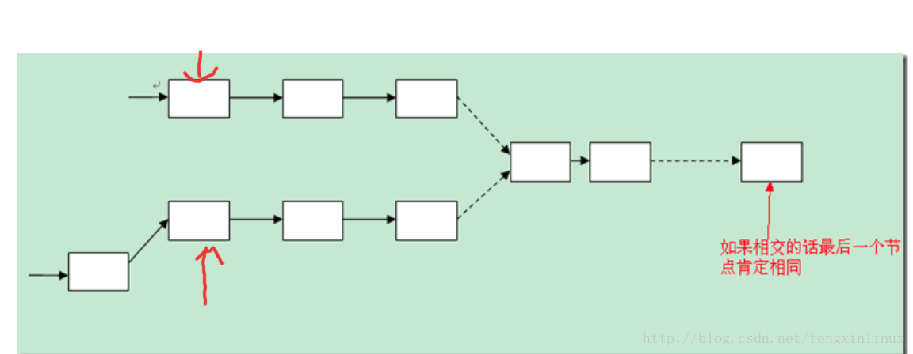

##  判判断一个链表是否有环，如何找到这个环的起点
给定一个单链表，只给出头指针h：

1. 如何判断是否存在环？
2. 如何知道环的长度L？
3. 如何找出环的连接点在哪里？
4. 带环链表的长度是多少？

### 解法：
1. 问题1，使用追赶的方法，设定两个指针slow、fast，从头指针开始，每次分别前进1步、2步。如存在环，则两者相遇；如不存在环，fast遇到NULL退出。
2. 问题2，记录下问题1的碰撞点p，slow从该点开始，再次回到该点所走过的操作数就是环的长度s。
3. 问题3：有定理：碰撞点p到连接点的距离=头指针到连接点的距离，因此，分别从碰撞点、头指针开始走，相遇的那个点就是连接点。

证明：链表起点到连接点的距离为x，连接点到相遇点的距离为y，圆的周长为L，
前置条件：`x<L` 为了保证相遇时slow还没走一圈，
slow 指针路程：s=x+y，fast指针路程等于`2s = 2(x+y) = x + L + y` 得到 `L=x+y`

4. 问题3中已经求出链表起点到连接点的长度x，加上问题2中求出的环的长度L，二者之和就是带环单链表的长度：x+L

## 判断两个相交链表的交点
同时遍历两个链表到尾部，同时记录两个链表的长度。若两个链表最后的一个节点相同，则两个链表相交。
有两个链表的长度后，我们就可以知道哪个链表长，设较长的链表长度为len1,短的链表长度为len2。
则先让较长的链表向后移动(len1-len2)个长度。然后开始从当前位置同时遍历两个链表，当遍历到的链表的节点相同时，则这个节点就是第一个相交的节点。

