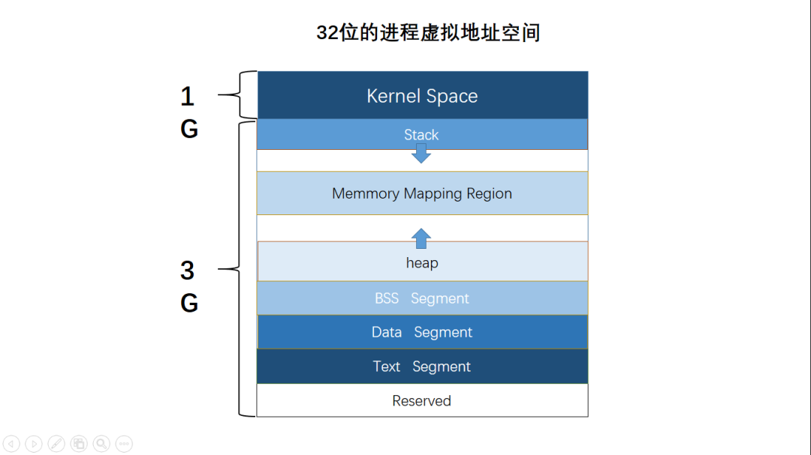

# 

##关键字作用解释：
### volatile(易变的，不可优化的，顺序性)
volatile 多出现在处理硬件的程序中，它的值由程序控制之外的过程控制，如系统时钟定时更新的变量，对象的值可能在程序的控制外改变。遇到这个关键字声明的变量，编译器对访问该变量的代码就不再进行优化，从而可以提供对特殊地址的稳定访问
#### 1. **易变性**: 
所谓的易变性，在汇编层面反映出来，就是两条语句，下一条语句不会直接使用上一条语句对应的volatile变量的寄存器内容，而是重新从内存中读取。
```
int a,b;
a =fun();
b=a+1;
```
#### 2. **不可优化**: 
volatile告诉编译器，不要对我这个变量进行各种激进的优化，甚至将变量直接消除，保证程序员写在代码中的指令，一定会被执行。
```
a = 1; mov eax,dword ptr [esp]
b = 2; mov ecx,dword ptr [esp+4]
c = 3; mov edx,dword ptr [esp+8]
printf("%d, %d, %d", a, b, c);//确保变量没有被常量替换
```
#### 3. **顺序性** [编译有序，cpu可以乱序]:
能够保证Volatile变量间的顺序性，编译器不会进行乱序优化。 

1. C/C++ Volatile变量，与非Volatile变量之间的操作，是可能被编译器交换顺序的。
2. C/C++ Volatile变量间的操作，是不会被编译器交换顺序的。
3. 哪怕将所有的变量全部都声明为volatile，哪怕杜绝了编译器的乱序优化，但是针对生成的汇编代码，
CPU有可能仍旧会乱序执行指令，导致程序依赖的逻辑出错，volatile对此无能为力,
4. 针对这个多线程的应用，真正正确的做法，是构建一个happens-before语义(Mutex、 Spinlock、 RWLock)。

## atomic_inc(&v)原子操作简述 
 atomic_inc(&v)对变量v用锁定总线的单指令进行不可分解的"原子"级增量操作，避免v的值由于中断或多处理器同时操作造成不确定状态。

 原子操作需要硬件的支持，因此是架构相关的，其API和原子类型的定义都定义在内核源码树的include/asm/atomic.h文件中，它们都使用汇编语言实现，因为C语言并不能实现这样的操作。

　　原子操作主要用于实现资源计数，很多引用计数(refcnt)就是通过原子操作实现的。原子类型定义如下：
1
`typedef struct { volatile int counter; } atomic_t;`

　　volatile修饰字段告诉gcc不要对该类型的数据做优化处理，对它的访问都是对内存的访问，而不是对寄存器的访问。 

### linux2.6.18之后删除了`<asm/atomic.h>`
gcc 提供了内置的原子操作函数，更适合用户态的程序使用.
gcc 4.1.2 起提供了__sync_*系列的built-in 函数，用于提供加减和逻辑运算的原子操作。
[__sync_fetch_and_add系列](https://www.cnblogs.com/jiu0821/p/7269542.html)

https://github.com/torvalds/linux.git
```
type __sync_fetch_and_add (type *ptr, type value); // 先fetch，然后自加; i++
type __sync_fetch_and_sub (type *ptr, type value);
type __sync_fetch_and_or (type *ptr, type value);
type __sync_fetch_and_and (type *ptr, type value);
type __sync_fetch_and_xor (type *ptr, type value);
type __sync_fetch_and_nand (type *ptr, type value);
type __sync_add_and_fetch (type *ptr, type value);// 先add，然后fetch; ++i
type __sync_sub_and_fetch (type *ptr, type value);
type __sync_or_and_fetch (type *ptr, type value);
type __sync_and_and_fetch (type *ptr, type value);
type __sync_xor_and_fetch (type *ptr, type value);
type __sync_nand_and_fetch (type *ptr, type value);
```
```
#include<stdio.h>
#include<string.h>
#include<stdlib.h>

static int count =0;
int main()
{
    __sync_fetch_and_add(&count,1);
    printf("res:%d\n",count);
}

```
## 最小值宏写法；
1. 临时变量消除副作用
2. typeof()获取入参实际类型
3. 取地址防止类型不一样
4. 加void消除结果未使用高级

(void)(&_x == &_y);可以产生的warning：
comparison between distinct pointer types ‘int*’ and ‘unsigned int*’ lacks a cast
```
#define max(x, y)                                                              \
  ({                                                                           \
    typeof(x) _x = (x);                                                        \
    typeof(y) _y = (y);                                                        \
    (void)(&_x == &_y);                                                        \
    _x > _y ? _x : _y;                                                         \
  })
```
### offsetof
offsetof 是一个宏，在 stddef.h 中定义

`＃define offsetof(struct_t,member) ((size_t)(char *)&((struct_t *)0)->member)`


## C程序内存分布



ebp -4 可以拿到参数地址

## [C可变参数](https://blog.csdn.net/xxxxxx91116/article/details/40478173)
```
void va_start(va_list ap, last);
type va_arg(va_list ap, type);
void va_end(va_list ap);
void va_copy(va_list dest, va_list src);
```

va_list是用于存放参数列表的数据结构。
va_start函数根据初始化last来初始化参数列表。
va_arg函数用于从参数列表中取出一个参数，参数类型由type指定。
va_copy函数用于复制参数列表。
va_end函数执行清理参数列表的工作。
引用自http://www.jb51.net/article/43192.htm
上述函数通常用宏来实现，例如标准ANSI形式下，这些宏的定义是：
```
typedef char * va_list; //字符串指针
#define _INTSIZEOF(n) ( (sizeof(n) + sizeof(int) - 1) & ~(sizeof(int) - 1) )
#define va_start(ap,v) ( ap = (va_list)&v + _INTSIZEOF(v) )
#define va_arg(ap,t) ( *(t *)((ap += _INTSIZEOF(t)) - _INTSIZEOF(t)) )
#define va_end(ap) ( ap = (va_list)0 )
```

使用宏_INTSIZEOF是为了按照 int 型长度字节对齐指针，因为c调用协议下面，参数入栈都是整数字节（指针或者值）

```
int FindMax (int n, ...)
{
  int i,val,largest;
  va_list vl;
  va_start(vl,n);
  largest=va_arg(vl,int);
  for (i=1;i<n;i++)
  {
    val=va_arg(vl,int);
    largest=(largest>val)?largest:val;
  }
  va_end(vl);
  return largest;
}
```

-------
### static

+ 控制变量的存储方式和可见性。

1.  修饰局部变量
    一般情况下，对于局部变量是存放在栈区的，并且局部变量的生命周期在该语句块执行结束时便结束了。但是如果用static进行修饰的话，该变量便存放在静态数据区，其生命周期一直持续到整个程序执行结束。但是在这里要注意的是，虽然用static对局部变量进行修饰过后，其生命周期以及存储空间发生了变化，但是其作用域并没有改变，其仍然是一个局部变量，作用域仅限于该语句块。

2.  修饰全局变量
    对于一个全局变量，它既可以在本源文件中被访问到，也可以在同一个工程的其它源文件中被访问(只需用extern进行声明即可)。用static对全局变量进行修饰改变了其作用域的范围，由原来的整个工程可见变为本源文件可见。

3.  修饰函数
    用static修饰函数的话，情况与修饰全局变量大同小异，就是改变了函数的作用域。

4.  C++中的static
    如果在C++中对类中的某个函数用static进行修饰，则表示该函数属于一个类而不是属于此类的任何特定对象；如果对类中的某个变量进行static修饰，表示该变量为类以及其所有的对象所有。它们在存储空间中都只存在一个副本。可以通过类和对象去调用。

### const

+ const名叫常量限定符，用来限定特定变量，以通知编译器该变量是不可修改的。习惯性的使用const，可以避免在函数中对某些不应修改的变量造成可能的改动。

    (1) const修饰基本数据类型

     1.  const修饰一般常量及数组

     基本数据类型，修饰符const可以用在类型说明符前，也可以用在类型说明符后，其结果是一样的。在使用这些常量的时候，只要不改变这些常量的值便好。

     2.  const修饰指针变量*及引用变量&

    如果const位于星号*的左侧，则const就是用来修饰指针所指向的变量，即指针指向为常量；

    如果const位于星号的右侧，const就是修饰指针本身，即指针本身是常量。

    (2) const应用到函数中,

     1. 作为参数的const修饰符

     调用函数的时候，用相应的变量初始化const常量，则在函数体中，按照const所修饰的部分进行常量化,保护了原对象的属性。
     [注意]：参数const通常用于参数为指针或引用的情况;

     2. 作为函数返回值的const修饰符

     声明了返回值后，const按照"修饰原则"进行修饰，起到相应的保护作用。

    (3) const在类中的用法

    不能在类声明中初始化const数据成员。正确的使用const实现方法为：const数据成员的初始化只能在类构造函数的初始化表中进行
    类中的成员函数：A fun4()const; 其意义上是不能修改所在类的的任何变量。

    (4) const修饰类对象，定义常量对象
    常量对象只能调用常量函数，别的成员函数都不能调用。
    [【C++ const的各种用法详解】]( http://www.cnblogs.com/wintergrass/archive/2011/04/15/2015020.html)

### extern

+ 在C语言中，修饰符extern用在变量或者函数的声明前，用来说明“此变量/函数是在别处定义的，要在此处引用”。

+ 注意extern声明的位置对其作用域也有关系，如果是在main函数中进行声明的，则只能在main函数中调用，在其它函数中不能调用。其实要调用其它文件中的函数和变量，只需把该文件用# include包含进来即可，为啥要用extern？因为用extern会加速程序的编译过程，这样能节省时间。

+  在C++中extern还有另外一种作用，用于指示C或者C＋＋函数的调用规范。比如在C＋＋中调用C库函数，就需要在C＋＋程序中用extern “C”声明要引用的函数。这是给链接器用的，告诉链接器在链接的时候用C函数规范来链接。主要原因是C＋＋和C程序编译完成后在目标代码中命名规则不同，用此来解决名字匹配的问题。

宏定义和展开、内联函数区别，

+    内联函数是代码被插入到调用者代码处的函数。如同 # define 宏，内联函数通过避免被调用的开销来提高执行效率，尤其是它能够通过调用（“过程化集成”）被编译器优化。 宏定义不检查函数参数，返回值什么的，只是展开，相对来说，内联函数会检查参数类型，所以更安全。    内联函数和宏很类似，而区别在于，宏是由预处理器对宏进行替代，而内联函数是通过编译器控制来实现的。而且内联函数是真正的函数，只是在需要用到的时候，内联函数像宏一样的展开，所以取消了函数的参数压栈，减少了调用的开销。

+    宏是预编译器的输入，然后宏展开之后的结果会送去编译器做语法分析。宏与函数等处于不同的级别，操作不同的实体。宏操作的是 token, 可以进行 token的替换和连接等操作，在语法分析之前起作用。而函数是语言中的概念，会在语法树中创建对应的实体，内联只是函数的一个属性。
+    对于问题：有了函数要它们何用？答案是：一：函数并不能完全替代宏，有些宏可以在当前作用域生成一些变量，函数做不到。二：内联函数只是函数的一种，内联是给编译器的提示，告诉它最好把这个函数在被调用处展开，省掉一个函数调用的开销（压栈，跳转，返回）

+    内联函数也有一定的局限性。就是函数中的执行代码不能太多了，如果，内联函数的函数体过大，一般的编译器会放弃内联方式，而采用普通的方式调用函数。这样，内联函数就和普通函数执行效率一样

内联函数必须是和函数体申明在一起，才有效。

[宏定义和内联函数区别](http://www.cnblogs.com/chengxuyuancc/archive/2013/04/04/2999844.html)

## 库函数实现：

### strncpy

`char *strncpy(char *destinin, char *source, int maxlen);`
```
#include<stdio.h>
#include<string.h>
int main(){
    char name[]={"Chinanet"},destin[20]={};
    strncpy(destin,name,3);
    printf("%s\n",destin);
}
```
1. source串长度 <= destin串长度(这里的串长度包含串尾NULL字符)
如果n<source由于长度达到source NULL，正常复制，特别注意，如果source中有NULL，strncpy复制到NULL即使没到n也提前停止。
如果n = source串长度，与strcpy一致。注意n的选择当n > destin串长度，destin栈空间溢出产生崩溃异常。
2. source串长度>destin串长度
如果n =destin串长度，则destin串没有NULL字符，会导致输出会有乱码。
如果不考虑source串复制完整性，可以将destin 最后一字符置为'\0'。
综上，一般情况下，使用strncpy时，建议将n置为destin串长度（除非你将多个source串都复制到destin数组，并且从destin尾部反向操作)，
复制完毕后，为保险起见，将destin串最后一字符置NULL，避免发生在第2)种情况下的输出乱码问题。
当然喽，无论是strcpy还是strncpy，保证destin串容量(能容纳下source串）才是最重要的。

### snprintf

`int snprintf(char *str, size_t size, const char *format, ...)`

将可变个参数(...)按照format格式化成字符串，然后将其复制到str中。

1. 如果格式化后的字符串长度 < size，则将此字符串全部复制到str中，并给其后添加一个字符串结束符('\0')；
2. 如果格式化后的字符串长度 >= size，则只将其中的(size-1)个字符复制到str中，并给其后添加一个字符串结束符('\0')，返回值为欲写入的字符串长度

### strcpy

`char *strcpy(char *dest, const char *src)`

1. 把 src 所指向的字符串复制到 dest。需要注意的是如果目标数组 dest 不够大，而源字符串的长度又太长，可能会造成缓冲溢出的情况。
2. 该函数返回一个指向最终的目标字符串 dest 的指针。

### strcmp

`int strcmp(const char *s1,const char *s2);`

strcmp函数是string compare(字符串比较)的缩写，用于比较两个字符串并根据比较结果返回整数。基本形式为strcmp(str1,str2)，
若str1=str2，则返回零；若str1<str2，则返回负数；若str1>str2，则返回正数。

规则：两个字符串自左向右逐个字符相比（按ASCII值大小相比较），直到出现不同的字符或遇'\0'为止。
### malloc


#### 声明

`void *malloc(size_t size)`
#### 参数
size -- 内存块的大小，以字节为单位。
#### 返回值
该函数返回一个指针 ，指向已分配大小的内存。如果请求失败，则返回 NULL。

### [mprotect](https://www.cnblogs.com/ims-/p/13222243.html) 修改内存区的保护属性

```
#include <unistd.h>
#include <sys/mmap.h>
int mprotect(const void *start, size_t len, int prot);
void *memalign(size_t alignment, size_t size)
```
mprotect()函数把自start开始的、长度为len的内存区的保护属性修改为prot指定的值。
prot可以取以下几个值，并且可以用“|”将几个属性合起来使用：

* 1）PROT_READ：表示内存段内的内容可写；
* 2）PROT_WRITE：表示内存段内的内容可读；
* 3）PROT_EXEC：表示内存段中的内容可执行；
* 4）PROT_NONE：表示内存段中的内容根本没法访问。

## char \*a 与char a[] 的区别
char \*d = "hello" 中的a是指向第一个字符‘a'的一个指针；char s[20] = "hello" 中数组名a也是执行数组第一个字符'h'的指针。现执行下列操作：strcat(d, s)。把字符串加到指针所指的字串上去，出现段错误，本质原因：\*d="0123456789"存放在常量区，是无法修的。而数组是存放在栈中，是可以修改的。两者区别如下：

+ 读写能力：char \*a = "abcd"此时"abcd"存放在常量区。通过指针只可以访问字符串常量，而不可以改变它。而char a[20] = "abcd"; 此时 "abcd"存放在栈。可以通过指针去访问和修改数组内容。

+ 赋值时刻：char \*a = "abcd"是在编译时就确定了（因为为常量）。而char a[20] = "abcd"; 在运行时确定

+ 存取效率：char \*a = "abcd"; 存于静态存储区。在栈上的数组比指针所指向字符串快。因此慢，而char a[20] = "abcd"存于栈上，快。
+ 另外注意：char a[] = "01234"，虽然没有指明字符串的长度，但是此时系统已经开好了，就是大小为6-----'0' '1' '2' '3' '4' '5' '\0'，(注意strlen(a)是不计'\0')