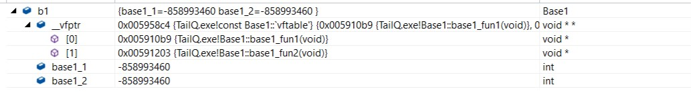

# C++中的虚函数(表)实现机制

## 1.没有虚函数的对象

实现

```
class Base1
{
public:
    int base1_1;
    int base1_2;

    void foo(){}
};
```
结果如下:

sizeof(Base1)|	8
-|-
offsetof(Base1, base1_1)|	0
offsetof(Base1, base1_2)|	4

和前面的结果是一样的? 不需要有什么疑问对吧?
因为如果一个函数不是虚函数,那么他就不可能会发生动态绑定,也就不会对对象的布局造成任何影响.
当调用一个非虚函数时, 那么调用的一定就是当前指针类型拥有的那个成员函数. 这种调用机制在编译时期就确定下来了.

## 2.拥有仅一个虚函数的类对象

类实现如下:
```
class Base1
{
public:
    int base1_1;
    int base1_2;

    virtual void base1_fun1() {}
};
```
结果如下:

sizeof(Base1)|	12
-|-
offsetof(__vfptr)|	0
offsetof(Base1, base1_1)|	4
offsetof(Base1, base1_2)|	8

<br>
咦? 多了4个字节? 且 base1_1 和 base1_2 的偏移都各自向后多了4个字节!
说明类对象的最前面被多加了4个字节的"东东", what's it?
现在, 我们通过VS2013来瞧瞧类Base1的变量b1的内存布局情况:
<div>


## 3.拥有多个虚函数的类对象

和前面一个例子差不多, 只是再加了一个虚函数. 定义如下:
```
class Base1
{
public:
    int base1_1;
    int base1_2;

    virtual void base1_fun1() {}
    virtual void base1_fun2() {}
};
```
大小以及偏移信息如下:

sizeof(Base1)|	12
-|-
offsetof(__vfptr)|	0
offsetof(Base1, base1_1)|	4
offsetof(Base1, base1_2)|	8

<br>
有情况!? 多了一个虚函数, 类对象大小却依然是12个字节!

再来看看VS形象的表现:


呀, __vfptr所指向的函数指针数组中出现了第2个元素, 其值为Base1类的第2个虚函数base1_fun2()的函数地址.

* 通过上面两张图表, 我们可以得到如下结论:

更加肯定前面我们所描述的: __vfptr只是一个指针, 她指向一个函数指针数组(即: 虚函数表)
增加一个虚函数, 只是简单地向该类对应的虚函数表中增加一项而已, 并不会影响到类对象的大小以及布局情况
前面已经提到过: __vfptr只是一个指针, 她指向一个数组, 并且: 这个数组没有包含到类定义内部, 那么她们之间是怎样一个关系呢?
不妨, 我们再定义一个类的变量b2, 现在再来看看__vfptr的指向:


通过Watch 1窗口我们看到:

b1和b2是类的两个变量, 理所当然, 她们的地址是不同的(见 &b1 和 &b2)
虽然b1和b2是类的两个变量, 但是: 她们的__vfptr的指向却是同一个虚函数表
由此我们可以总结出:

同一个类的不同实例共用同一份虚函数表, 她们都通过一个所谓的虚函数表指针__vfptr(定义为void**类型)指向该虚函数表.

* 这个虚函数表保存在哪里呢? 其实, 我们无需过分追究她位于哪里, 重点是:

1. 她是编译器在编译时期为我们创建好的, 只存在一份
2. 定义类对象时, 编译器自动将类对象的__vfptr指向这个虚函数表

## 4.单继承且子类不存在虚函数的内存布局

```
class Base1
{
public:
    int base1_1;
    int base1_2;

    virtual void base1_fun1() {}
    virtual void base1_fun2() {}
};

class Derive1 : public Base1
{
public:
    int derive1_1;
    int derive1_2;
};
```
没错! 基类在上边, 继承类的成员在下边依次定义! 


经展开后来看, 前面部分完全就是Base1的东西: 虚函数表指针+成员变量定义.
并且, Base1的虚函数表的[0][1]两项还是其本身就拥有的函数: base1_fun1() 和 base1_fun2().

## 5.本身不存在虚函数(不严谨)但存在基类虚函数覆盖的单继承类的内存布局

标题`本身不存在虚函数`的说法有些不严谨, 我的意思是说: 除经过继承而得来的基类虚函数以外, 自身没有再定义其它的虚函数.

Ok, 既然存在基类虚函数覆盖, 那么来看看接下来的代码会产生何种影响:

```
class Base1
{
public:
    int base1_1;
    int base1_2;

    virtual void base1_fun1() {}
    virtual void base1_fun2() {}
};

class Derive1 : public Base1
{
public:
    int derive1_1;
    int derive1_2;

    // 覆盖基类函数
    virtual void base1_fun1() {}
};
```

可以看到, Derive1类 重写了Base1类的base1_fun1()函数, 也就是常说的虚函数覆盖. 现在是怎样布局的呢?


特别注意我高亮的那一行: 原本是Base1::base1_fun1(), 但由于**继承类重写**了基类Base1的此方法, 所以现在变成了Derive1::base1_fun1()!

那么, 无论是通过Derive1的指针还是Base1的指针来调用此方法, 调用的都将是被继承类重写后的那个方法(函数), 多态发生鸟!!!

那么新的布局图:


## 6.子类定义了基类没有的虚函数的单继承的类对象布局

说明一下: 由于前面一种情况只会造成覆盖基类虚函数表的指针, 所以接下来我不再同时讨论虚函数覆盖的情况.

继续贴代码:

```
class Base1
{
public:
    int base1_1;
    int base1_2;

    virtual void base1_fun1() {}
    virtual void base1_fun2() {}
};

class Derive1 : public Base1
{
public:
    int derive1_1;
    int derive1_2;

    virtual void derive1_fun1() {}
};
```

和第5类不同的是多了一个自身定义的虚函数. 和第6类不同的是没有基类虚函数的覆盖.


咦, 有没有发现问题? 表面上看来几乎和第5种情况完全一样? 为嘛呢?
现在继承类明明定义了自身的虚函数, 但不见了??

好吧, 既然表面上没办法了, 我们就只能从汇编入手了, 来看看调用derive1_fun1()时的代码:
```
Derive1 d1;
Derive1* pd1 = &d1;
pd1->derive1_fun1();
```
要注意: 我为什么使用指针的方式调用? 说明一下: 因为如果不使用指针调用, 虚函数调用是不会发生动态绑定的哦! 你若直接 d1.derive1_fun1(); , 是不可能会发生动态绑定的, 但如果使用指针: pd1->derive1_fun1(); , 那么 pd1就无从知道她所指向的对象到底是Derive1 还是继承于Derive1的对象, 虽然这里我们并没有对象继承于Derive1, 但是她不得不这样做, 毕竟继承类不管你如何继承, 都不会影响到基类, 对吧?

```
; pd1->derive1_fun1();
00825466  mov         eax,dword ptr [pd1]  
00825469  mov         edx,dword ptr [eax]  
0082546B  mov         esi,esp  
0082546D  mov         ecx,dword ptr [pd1]  
00825470  mov         eax,dword ptr [edx+8]  
00825473  call        eax
```
汇编代码解释:

第2行: 由于pd1是指向d1的指针, 所以执行此句后 eax 就是d1的地址
第3行: 又因为Base1::__vfptr是Base1的第1个成员, 同时也是Derive1的第1个成员, 那么: &__vfptr == &d1, clear? 所以当执行完 mov edx, dword ptr[eax] 后, edx就得到了__vfptr的值, 也就是虚函数表的地址.
第5行: 由于是__thiscall调用, 所以把this保存到ecx中.
第6行: 一定要注意到那个 edx+8, 由于edx是虚函数表的地址, 那么 edx+8将是虚函数表的第3个元素, 也就是__vftable[2]!!!
第7行: 调用虚函数.

结果:

现在我们应该知道内幕了! 继承类Derive1的虚函数表被加在基类的后面! 事实的确就是这样!
由于Base1只知道自己的两个虚函数索引[0][1], 所以就算在后面加上了[2], Base1根本不知情, 不会对她造成任何影响.
如果基类没有虚函数呢? 这个问题我们留到第9小节再来讨论!
实际类对象布局表示:


## 7.多继承且存在虚函数覆盖同时又存在自身定义的虚函数的类对象布局

真快, 该看看多继承了, 多继承很常见, 特别是接口类中!

依然写点小类玩玩:
```
class Base1
{
public:
    int base1_1;
    int base1_2;

    virtual void base1_fun1() {}
    virtual void base1_fun2() {}
};

class Base2
{
public:
    int base2_1;
    int base2_2;

    virtual void base2_fun1() {}
    virtual void base2_fun2() {}
};

// 多继承
class Derive1 : public Base1, public Base2
{
public:
    int derive1_1;
    int derive1_2;

    // 基类虚函数覆盖
    virtual void base1_fun1() {}
    virtual void base2_fun2() {}

    // 自身定义的虚函数
    virtual void derive1_fun1() {}
    virtual void derive1_fun2() {}
};
```


结论:

按照基类的声明顺序, 基类的成员依次分布在继承中.
注意被我高亮的那两行, 已经发生了虚函数覆盖!
我们自己定义的虚函数呢? 怎么还是看不见?!
反汇编代码如下:
```
; pd1->derive1_fun2();
00995306  mov         eax,dword ptr [pd1]  
00995309  mov         edx,dword ptr [eax]  
0099530B  mov         esi,esp  
0099530D  mov         ecx,dword ptr [pd1]  
00995310  mov         eax,dword ptr [edx+0Ch]  
00995313  call        eax
```
第2行: 取d1的地址
第3行: 取Base1::__vfptr的值!!
第6行: 0x0C, 也就是第4个元素(下标为[3])

结论:

Derive1的虚函数表依然是保存到第1个拥有虚函数表的那个基类的后面的.

看看现在的类对象布局图:


## 8.如果第一个直接基类没有虚函数(表)

```
class Base1
{
public:
    int base1_1;
    int base1_2;
};

class Base2
{
public:
    int base2_1;
    int base2_2;

    virtual void base2_fun1() {}
    virtual void base2_fun2() {}
};

// 多继承
class Derive1 : public Base1, public Base2
{
public:
    int derive1_1;
    int derive1_2;

    // 自身定义的虚函数
    virtual void derive1_fun1() {}
    virtual void derive1_fun2() {}
};

```
来看看VS的布局:


所以不难验证: **我们前面的推断是正确的, 谁有虚函数表, 谁就放在前面!**

现在类的布局情况:


## 9.如果两个基类都没有虚函数表
```
class Base1
{
public:
    int base1_1;
    int base1_2;
};

class Base2
{
public:
    int base2_1;
    int base2_2;
};

// 多继承
class Derive1 : public Base1, public Base2
{
public:
    int derive1_1;
    int derive1_2;

    // 自身定义的虚函数
    virtual void derive1_fun1() {}
    virtual void derive1_fun2() {}
};
```
前面吃了个亏, 现在先来看看VS的基本布局:


可以看到, 现在__vfptr已经独立出来了, 不再属于Base1和Base2!

看看求偏移情况:


Ok, 问题解决! 注意高亮的那两行, &d1==&d1.__vfptr, 说明虚函数始终在最前面!

不用再废话, 相信大家对这种情况已经有底了.

对象布局:

