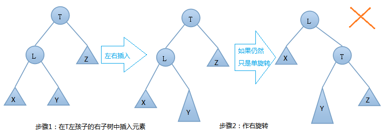

# data Struct

## hash 散列

 冲突解决方法
 
### 链接法

把散列到同一槽中的所有元素都放在一个链表中。

### 开放寻址法
这个方法的基本思想是：当发生地址冲突时，按照某种方法继续探测哈希表中的其他存储单元，直到找到空位置为止。这个过程可用下式描述： 
H i ( key ) = ( H ( key )+ d i ) mod m ( i = 1,2,…… ， k ( k ≤ m – 1)) 
其中： H ( key ) 为关键字 key 的直接哈希地址， m 为哈希表的长度， di 为每次再探测时的地址增量。 
采用这种方法时，首先计算出元素的直接哈希地址 H ( key ) ，如果该存储单元已被其他元素占用，则继续查看地址为 H ( key ) + d 2 的存储单元，如此重复直至找到某个存储单元为空时，将关键字为 key 的数据元素存放到该单元。 
增量 d 可以有不同的取法，并根据其取法有不同的称呼： 

( 1 ) d i ＝ 1 ， 2 ， 3 ， …… 线性探测再散列； 

( 2 ) d i ＝ 1^2 ，－ 1^2 ， 2^2 ，－ 2^2 ， k^2， -k^2…… 二次探测再散列； 

( 3 ) d i ＝ 伪随机序列 伪随机再散列；

### 再哈希

当发生冲突时，使用第二个、第三个、哈希函数计算地址，直到无冲突时。缺点：计算时间增加。
比如上面第一次按照姓首字母进行哈希，如果产生冲突可以按照姓字母首字母第二位进行哈希，再冲突，第三位，直到不冲突为止

### 建立一个公共溢出区
假设哈希函数的值域为[0,m-1],则设向量HashTable[0..m-1]为基本表，另外设立存储空间向量OverTable[0..v]用以存储发生冲突的记录。
经过以上方法，基本可以解决掉hash算法冲突的问题。

### 完全散列

第一级与带链接的散列表基本上是一样的，利用全域散列函数将关键字散列到m个槽中，
利用**二次散列表**以及相关函数代替链表，精心选择散列函数，保证第二级上不出现冲突。


## 二叉树基本性质


### 前序遍历DLR
*根结点 ---> 左子树 ---> 右子树*
```
void front(Tree* node)  //前序遍历  
{  
if(node){  
    cout << node->val <<"  ";  
    front(node->lchild);  
    front(node->rchild);  
}  
}  
```

### 中序遍历LDR
*左子树---> 根结点 ---> 右子树*

```
void middle(Tree* node)  //中序遍历  
{  
if(node){  
    middle(node->lchild);  
    cout<<node->val<<"  ";  
    middle(node->rchild);  
}  
}  
```
### 后序遍历LRD
*左子树 ---> 右子树 ---> 根结点*

```
void back(Tree* node)  //后序遍历 
{  
if(node){  
    back(node->lchild);  
    back(node->rchild);  
    cout<<node->val<<"  ";   
}  
}  
```

### 二叉树顺序推断

前序遍历：根左右, 
中序遍历：左根右, 
后序遍历：左右根.

* 前序的第一个是整个树的根
* 后序的最后一个是整个树的根
* 中序用来判别左右子树的划分
* 前序序列中左子树部分的第一个节点是左子树的根节点
* 前序序列中右子树部分的第一个节点是右子树的根节点

例题：前序 HGEDBFCA, 中序 EGBDHFAC

得到后续：EBDGACFH

----

## 二叉搜索树BST(左小右大)
*Binary Search Tree(不保证平衡)*

二叉搜索树的基本操作花费时间和树高度成正比，对于n个节点的完全二叉树来说，基本操作时间位O(lgn)。 最坏情况是不分叉的单链，时间是 O(n). 随机二叉树期望高度是O(lg n).

### BST树定义
+ 设 x 为二叉搜索树的一个节点，如果 y 是 x 左子树的一个节点，那么 y.key <= x.key； 如果 z 是 x 右子树的一个节点，那么 z.key >= x.key

### [BSTCode](code/bstTree.cpp)
### 查询二叉搜索树

####  递归方式

```
TREE_SEARCH(x,k)
if x == NIL or k == x.key
    return x
if k < x.key
    return TREE_SEARCH(x.left,k)
else return TREE_SEARCH(x.left,k)
```
####  循环 

```
ITER_TREE_SEARCH(x,k)
while x != NIL && k != x.key
    if k < x.key
        x == x.left
    else 
        x = x.right
return x
```
#### 查最小值
根据二叉树的性质，最小值在最左下方
```
TREE_MIN(x)
while x.left != NIL
    x = x.left
return x
```

## 自平衡二叉查找树AVL
*Adelson-Velsky-Landis Tree*

### AVL树定义

AVL树本质上是一颗二叉查找树，但是它又具有以下特点：
+ 它是一棵空树或它的左右两个子树的高度差的绝对值不超过1，并且左右两个子树都是一棵平衡二叉树。
+ 在AVL树中任何节点的两个子树的高度最大差别为一，所以它也被称为平衡二叉树。下面是平衡二叉树和非平衡二叉树对比的例图：


### AVL树的作用

我们知道，对于一般的二叉搜索树（Binary Search Tree），其期望高度（即为一棵平衡树时）为log2n，其各操作的时间复杂度（O(log2n)）同时也由此而决定。但是，在某些极端的情况下（如在插入的序列是有序的时），二叉搜索树将退化成近似链或链，此时，其操作的时间复杂度将退化成线性的，即O(n)。


我们可以通过随机化建立二叉搜索树来尽量的避免这种情况，但是在进行了多次的操作之后，由于在删除时，我们总是选择将待删除节点的后继代替它本身，这样就会造成总是右边的节点数目减少，以至于树向左偏沉。这同时也会造成树的平衡性受到破坏，提高它的操作的时间复杂度。
　　例如：我们按顺序将一组数据1,2,3,4,5,6分别插入到一颗空二叉查找树和AVL树中，插入的结果如下图：


由上图可知，同样的结点，由于插入方式不同导致树的高度也有所不同。特别是在带插入结点个数很多且正序的情况下，会导致二叉树的高度是O(N)，而AVL树就不会出现这种情况，树的高度始终是O(lgN).高度越小，对树的一些基本操作的时间复杂度就会越小。这也就是我们引入AVL树的原因.

### AVL树的基本操作：

AVL树的操作基本和二叉查找树一样，这里我们关注的是两个变化很大的操作：插入和删除！

　　我们知道，AVL树不仅是一颗二叉查找树，它还有其他的性质。如果我们按照一般的二叉查找树的插入方式可能会破坏AVL树的平衡性。同理，在删除的时候也有可能会破坏树的平衡性，所以我们要做一些特殊的处理，包括：单旋转和双旋转！

#### AVL树的插入，单旋转的第一种情况---右旋：


由上图可知：在插入之前树是一颗AVL树，而插入之后结点T的左右子树高度差的绝对值不再 < 1,此时AVL树的平衡性被破坏，我们要对其进行旋转。由上图可知我们是在结点T的左结点的左子树上做了插入元素的操作，我们称这种情况为左左情况，我们应该进行右旋转(只需旋转一次，故是单旋转)。具体旋转步骤是：

　　T向右旋转成为L的右结点，同时，Y放到T的左孩子上。这样即可得到一颗新的AVL树，旋转过程图如下：

　左左情况的右旋举例：


#### AVL树的插入，单旋转的第二种情况---左旋：


由上图可知：在插入之前树是一颗AVL树，而插入之后结点T的左右子树高度差的绝对值不再 < 1,此时AVL树的平衡性被破坏，我们要对其进行旋转。由上图可知我们是在结点T的右结点的右子树上做了插入元素的操作，我们称这种情况为右右情况，我们应该进行左旋转(只需旋转一次，故事单旋转)。具体旋转步骤是：

　　　T向右旋转成为R的左结点，同时，Y放到T的左孩子上。这样即可得到一颗新的AVL树，旋转过程图如下：

　右右情况的左旋举例:


以上就是插入操作时的单旋转情况！我们要注意的是：谁是T谁是L，谁是R还有谁是X,Y,Z!T始终是开始不平衡的左右子树的根节点。显然L是T的左结点，R是T的右节点。X、Y、Y是子树当然也可以为NULL.NULL归NULL，但不能破坏插入时我上面所说的左左情况或者右右情况。

#### AVL树的插入，双旋转的第一种情况---左右(先左后右)旋：

由上图可知，我们在T结点的左结点的右子树上插入一个元素时，会使得根为T的树的左右子树高度差的绝对值不再 < 1，如果只是进行简单的右旋，得到的树仍然是不平衡的。我们应该按照如下图所示进行二次旋转：


　左右情况的左右旋转实例：


#### AVL树的插入，双旋转的第二种情况---右左(先右后左)旋：


　　由上图可知，我们在T结点的右结点的左子树上插入一个元素时，会使得根为T的树的左右子树高度差的绝对值不再 < 1，如果只是进行简单的左旋，得到的树仍然是不平衡的。我们应该按照如下图所示进行二次旋转：


　右左情况的右左旋转实例：


### AVL树的插入代码实现:

[avl tree code](code/avlTree.cpp)

## RB树

最坏基本动态操作集合时间是 O(lg n)

### 红黑树的性质

红黑树是一种含有红黑结点并能自平衡的二叉查找树。它必须满足下面性质：

+ 性质1：每个节点要么是黑色，要么是红色。
+ 性质2：根节点 和叶子节点（NIL）是黑色。
+ 性质3：每个红色结点的两个子结点一定都是黑色。
+ 性质4：任意一结点到每个叶子结点的路径都包含数量相同的黑结点。

从性质4又可以推出：

+ 性质4.1：如果一个结点存在黑子结点，那么该结点肯定有两个子结点

[rb tree code](code/rbTree.cpp)

## B 树

大部分非关系型数据库 mongoDB 用 B- 树作为索引


下面来具体介绍一下B-树（Balance Tree），一个m阶的B树具有如下几个特征：  
m 阶数，最小度数k >= 2; and m/2 <= k <= m

1. 根结点至少有一个关键字两个子女。(t=2)
2. 中间节点都包含k-1个元素和k个孩子 
3. 叶子节点都包含k-1个元素
4. 所有的叶子结点都位于同一层。
5. 每个节点中的元素从小到大排列，节点当中k-1个元素正好是k个孩子包含的元素的值域分划。

## B+
B+树是B树的一种变形，比B树具有更广泛的应用，m阶 B+树有如下特征: 
m/2 <= k <= m

1. 根结点至少有两个子女;
2. 中间结点都含有k关键字以及k个子节点； 
3. 叶子节点都包含k个元素
4. B+树的查找与B树不同，当索引部分某个结点的关键字与所查的关键字相等时，并不停止查找，应继续沿着这个关键字左边的指针向下，一直查到该关键字所在的叶子结点为止。

## B+树与B-树
B+树是应文件系统所需而产生的一种B-树的变形树。一棵m阶的B+树和m阶的B树的差异在于:

1. 有n棵子树的结点中含有n个关键码；
2. 所有的叶子结点中包含了全部关键码的信息，及指向含有这些关键码记录的指针，且叶子结点本身依关键码的大小自小而大的顺序链接；
3. 所有的非终端结点可以看成是索引部分，结点中仅含有其子树根结点中最大(或最小)关键码。


这都是由于B+树和B具有不同的存储结构所造成的区别，
以一个m阶树为例。

1. **关键字的数量** 不同；B+树中分支结点有m个关键字，其叶子结点也有m个，其关键字只是起到了一个索引的作用，但是B树虽然也有m个子结点，但是其只拥有m-1个关键字。
2. **数据存储的位置** 不同；B+树中的数据都存储在叶子结点上，也就是其所有叶子结点的数据组合起来就是完整的数据，但是B树的数据存储在每一个结点中，并不仅仅存储在叶子结点上。
4. **查询** 不同；B树在找到具体的数值以后，则结束，而B+树则需要通过索引找到叶子结点中的数据才结束，也就是说B+树的搜索过程中走了一条从根结点到叶子结点的路径。

 B+树优点：由于B+树的数据都存储在叶子结点中，分支结点均为索引，方便扫库，只需要扫一遍叶子结点即可，但是B树因为其分支结点同样存储着数据，我们要找到具体的数据，需要进行一次中序遍历按序来扫，所以B+树更加适合在区间查询的情况，所以通常B+树用于数据库索引，而B树则常用于文件索引。
