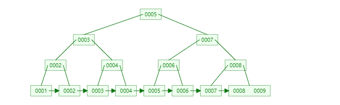
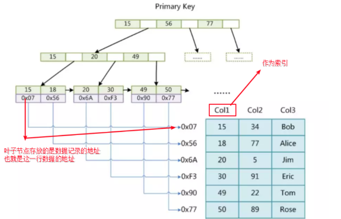

# mysql

## [最全MySQL面试题和答案](https://www.cnblogs.com/lijiasnong/p/9963905.html)

## Mysql 的存储引擎:myisam和innodb的区别。

1. MyISAM 是非事务的存储引擎，适合用于频繁查询的应用。表锁，不会出现死锁，适合小数据，小并发。
   **MyISAM**：成熟、稳定、易于管理，快速读取。一些功能不支持（事务等），表级锁。
2. innodb是支持事务的存储引擎，合于插入和更新操作比较多的应用，设计合理的话是行锁（最大区别就在锁的级别上），适合大数据，大并发。
   **InnoDB**：支持事务、外键等特性、数据行锁定。空间占用大，不支持全文索引等。

[Mysql数据库表的类型有哪些](https://blog.csdn.net/shaukon/article/details/85619719)

答：Myslq一共向用户提供了包括DBD，HEAP，ISAM，MERFE，MyISAM，InnoDB以及Gemeni这7种Mysql表类型，其中DBD，InnoDB属于事物安全类表，而其他属于事物非安全类表。
```
mysql> show engines;
+--------------------+---------+----------------------------------------------------------------+--------------+------+------------+
| Engine             | Support | Comment                                                        | Transactions | XA   | Savepoints |
+--------------------+---------+----------------------------------------------------------------+--------------+------+------------+
| ARCHIVE            | YES     | Archive storage engine                                         | NO           | NO   | NO         |
| BLACKHOLE          | YES     | /dev/null storage engine (anything you write to it disappears) | NO           | NO   | NO         |
| MRG_MYISAM         | YES     | Collection of identical MyISAM tables                          | NO           | NO   | NO         |
| FEDERATED          | NO      | Federated MySQL storage engine                                 | NULL         | NULL | NULL       |
| MyISAM             | YES     | MyISAM storage engine                                          | NO           | NO   | NO         |
| PERFORMANCE_SCHEMA | YES     | Performance Schema                                             | NO           | NO   | NO         |
| InnoDB             | DEFAULT | Supports transactions, row-level locking, and foreign keys     | YES          | YES  | YES        |
| MEMORY             | YES     | Hash based, stored in memory, useful for temporary tables      | NO           | NO   | NO         |
| CSV                | YES     | CSV storage engine                                             | NO           | NO   | NO         |
+--------------------+---------+----------------------------------------------------------------+--------------+------+------------+
```
## MySQL数据库设计步骤，注意事项
1. 设计良好的数据库结构，允许部分数据冗余，尽量避免join查询，提高效率。
2. 选择合适的表字段数据类型和存储引擎，适当的添加索引。
3. mysql库主从读写分离。
4. 找规律分表，减少单表中的数据量提高查询速度。
5. 添加缓存机制，比如memcached，apc等。
6. 书写高效率的SQL。比如 SELECT * FROM TABEL 改为 SELECT field_1, field_2, field_3 FROM TABLE.

## char/varchar

char 是一种固定长度的类型，varchar则是一种可变长度的类型，
它们的区别是：
char(M)类型的数据列里，每个值都占用M个字节，如果某个长度小于M，MySQL就会在它的右边用空格字符补足．（在检索操作中那些填补出来的空格字符将被去掉）在varchar(M)类型的数据列里，每个值只占用刚好够用的字节再加上一个用来记录其长度的字节（即总长度为L+1字节）．  

varchar适用场景:

字符串列得最大长度比平均长度大很多 2.字符串很少被更新，容易产生存储碎片 3.使用多字节字符集存储字符串

Char场景:

存储具有近似得长度（md5值,身份证，手机号）,长度比较短小得字符串（因为varchar需要额外空间记录字符串长度），更适合经常更新得字符串，更新时不会出现页分裂得情况，避免出现存储碎片，获得更好的io性能

## mysql 查询过程


1. 客户端发送一条查询给服务器
2. 服务器先检查查询缓存(见下面注释),如果命中了缓存,则立刻返回存储在缓存中的结果.否则,进入下一个阶段
3. 服务器进行SQL解析.预处理,再由优化器生成对应的执行计划.
4. MySQL根据优化器生成的执行计划,调用存储引擎的API来执行查询.
5. 将结果返回给客户端

注释:
查询缓存:在解析一个查询语句前,如果缓存是打开的,那么MySQL会优先检查这个查询是否命中查询缓存中的数据.如果没有命中,则进入下一阶段的处理.如果命中查询缓存,则会检查用户的权限,如果权限没有问题,MySQL会跳过其他阶段,直接拿数据返回给客户端.
(摘自高性能mysql第三版)

### [MySQL查询分析器EXPLAIN或DESC用法](https://blog.csdn.net/helloxiaozhe/article/details/79951354) 

## MYSQL 的事物处理
### 什么是事务

MySQL 事务主要用于处理操作量大，复杂度高的数据。比如说，在人员管理系统中，你删除一个人员，你即需要删除人员的基本资料，也要删除和该人员相关的信息，如信箱，文章等等，这样，这些数据库操作语句就构成一个事务！

+ 在 MySQL 中只有使用了 **Innodb 数据库引擎**的数据库或表才支持事务。
+ 事务处理可以用来维护数据库的完整性，保证成批的 SQL 语句要么全部执行，要么全部不执行。
+ 事务用来管理 insert,update,delete 语句

### 事务是必须满足4个条件（ACID）

原子性（Atomicity，或称不可分割性）、一致性（Consistency）、隔离性（Isolation，又称独立性）、持久性（Durability）。

+ **原子性**：一个事务（transaction）中的所有操作，要么全部完成，要么全部不完成，不会结束在中间某个环节。事务在执行过程中发生错误，会被回滚（Rollback）到事务开始前的状态，就像这个事务从来没有执行过一样。

+ **一致性**：在事务开始之前和事务结束以后，数据库的完整性没有被破坏。这表示写入的资料必须完全符合所有的预设规则，这包含资料的精确度、串联性以及后续数据库可以自发性地完成预定的工作。

+ **隔离性**：数据库允许多个并发事务同时对其数据进行读写和修改的能力，隔离性可以防止多个事务并发执行时由于交叉执行而导致数据的不一致。事务隔离分为不同级别，包括读未提交（Read uncommitted）、读提交（read committed）、可重复读（repeatable read）和串行化（Serializable）。

+ **持久性**：事务处理结束后，对数据的修改就是永久的，即便系统故障也不会丢失。

### MYSQL 事务处理主要有两种方法：
#### 1、用 BEGIN, ROLLBACK, COMMIT来实现

BEGIN 开始一个事务
ROLLBACK 事务回滚
COMMIT 事务确认

#### 2、直接用 SET 来改变 MySQL 的自动提交模式:

SET AUTOCOMMIT=0 禁止自动提交
SET AUTOCOMMIT=1 开启自动提交

### 事务的隔离级别
数据库事务的隔离级别有4个，由低到高依次为Read uncommitted(未授权读取、读未提交)、Read committed（授权读取、读提交）、Repeatable read（可重复读取）、Serializable（序列化），这四个级别可以逐个解决脏读、不可重复读、幻象读这几类问题。

+ Read uncommitted(未授权读取、读未提交)： 
如果一个事务已经开始写数据，则另外一个事务则不允许同时进行写操作，但允许其他事务读此行数据。该隔离级别可以通过“排他写锁”实现。这样就避免了更新丢失，却可能出现脏读。也就是说事务B读取到了事务A未提交的数据。
+ Read committed（授权读取、读提交）： 
读取数据的事务允许其他事务继续访问该行数据，但是未提交的写事务将会禁止其他事务访问该行。该隔离级别避免了脏读，但是却可能出现不可重复读。事务A事先读取了数据，事务B紧接了更新了数据，并提交了事务，而事务A再次读取该数据时，数据已经发生了改变。
+ **Repeatable read**（可重复读取，类似读写锁）： 
可重复读是指在一个事务内，多次读同一数据。在这个事务还没有结束时，另外一个事务也访问该同一数据。那么，在第一个事务中的两次读数据之间，即使第二个事务对数据进行修改，第一个事务两次读到的的数据是一样的。这样就发生了在一个事务内两次读到的数据是一样的，因此称为是可重复读。读取数据的事务将会禁止写事务（但允许读事务），写事务则禁止任何其他事务。这样避免了不可重复读取和脏读，但是有时可能出现幻象读。（读取数据的事务）这可以通过“共享读锁”和“排他写锁”实现。
+ Serializable（序列化）： 
提供严格的事务隔离。它要求事务序列化执行，事务只能一个接着一个地执行，但不能并发执行。如果仅仅通过“行级锁”是无法实现事务序列化的，必须通过其他机制保证新插入的数据不会被刚执行查询操作的事务访问到。序列化是最高的事务隔离级别，同时代价也花费最高，性能很低，一般很少使用，在该级别下，事务顺序执行，不仅可以避免脏读、不可重复读，还避免了幻像读。


隔离级别越高，越能保证数据的完整性和一致性，但是对并发性能的影响也越大。对于多数应用程序，可以优先考虑把数据库系统的隔离级别设为Read Committed。它能够避免脏读取，而且具有较好的并发性能。尽管它会导致不可重复读、幻读和第二类丢失更新这些并发问题，在可能出现这类问题的个别场合，可以由应用程序采用悲观锁或乐观锁来控制。大多数数据库的默认级别就是Read committed，比如Sql Server , Oracle。

MySQL的默认隔离级别就是:可重复读Repeatable read。


-----------------------------

## 数据库的基本操作

### 修改用户密码
`update user set authentication_string=password('123456') where user='ims';`

### 创建数据库

`CREATE DATABASE 数据库名;`

### 创建表
```
CREATE TABLE test(
    id INT NOT NULL AUTO_INCREMENT  PRIMARY KEY ,
    title VARCHAR(100) NOT NULL,
    author CHAR(20) NOT NULL,
    submission_date DATE
    )DEFAULT CHARSET=utf8;
```
+ 显示表信息命令: `show create table test`, 类似`desc`,只是前者按命令格式。
+ 修改表引擎的命令 : `alter table test engine = innodb;` 

InnoDB 主键使用的是聚簇索引，MyISAM 不管是主键索引，还是二级索引使用的都是非聚簇索引

### 删除表
`DROP TABLE table_name ;`

### 插入数据

```
INSERT INTO table_name ( field1, field2,...fieldN ) VALUES ( value1, value2,...valueN );
```

### 删除数据
```
DELETE FROM table_name [WHERE Clause]
DELETE FROM runoob_tbl WHERE runoob_id=3;
```

### 更新数据

```
UPDATE table_name SET field1=new-value1, field2=new-value2
[WHERE Clause]
```

### 修改表字段

+ 删除字段 i
` ALTER TABLE testalter_tbl  DROP i;`
+ 添加字段
`ALTER TABLE testalter_tbl ADD i INT;`

+ 修改字段类型
`ALTER TABLE testalter_tbl MODIFY c CHAR(10);`
+ 修改字段类型及名称
`ALTER TABLE testalter_tbl CHANGE i j BIGINT;`

+ 修改表名
`ALTER TABLE testalter_tbl RENAME TO alter_tbl;`

## [MySQL 索引](https://www.cnblogs.com/wangsen/p/10864136.html)

MySQL索引的建立对于MySQL的高效运行是很重要的，索引可以大大提高MySQL的检索速度。

创建索引时，你需要确保该**索引是应用在 SQL 查询语句的条件**(一般作为 WHERE 子句的条件)。

上面都在说使用索引的好处，但过多的使用索引将会造成滥用。因此索引也会有它的缺点：虽然索引大大提高了查询速度，同时却会降低更新表的速度，如对表进行INSERT、UPDATE和DELETE。因为更新表时，MySQL不仅要保存数据，还要保存一下索引文件。

### 怎样提高查询性能

简单的理解：一张数据量比较大的表格如果没有添加任何索引，那我们在执行查询的时候
就会是进行全表扫描，逐行比对，这样的读取效率肯定很低，如果我们为数据创建了索引
索引的实现方式又是支持快速查询的这样我们只需要先查询索引中符合条件的，
然后再通过索引指向的数据行位置就可以实现快速定位数据了，不用全表扫描了。

### 索引存储位置

数据库索引是存储在磁盘上，当表中的数据量比较大时，索引的大小也跟着增长，达到几个G甚至更多。
当我们利用索引进行查询的时候，不可能把索引全部加载到内存中，只能加载一部分其他的都要从磁盘中读取后加载到内存。

### 索引分类

+ 主键索引
一个列为设置为主键会默认创建一个主键索引。
主键索引是唯一索引的特定类型。该索引要求主键中的每个值都唯一。当创建或更改表时可通过定义 `PRIMARY KEY` 约束来创建主键。一个表只能有一个主键列，且该列不能接受空值。 由于 PRIMARY KEY 约束确保唯一数据，所以经常用来定义标识列.

+ 唯一索引
严格来说主键索引是唯一索引的一种，这两个的区别是：主键索引不允许为null，唯一索引可以为null;
+ 单列索引
即一个索引只包含单个列，一个表可以有多个单列索引，但这不是组合索引。
+ 复合索引
即一个索引包含多个列。

### 主键、外键和索引的区别？

#### 定义：

 主键–唯一标识一条记录，不能有重复的，不允许为空

 外键–表的外键是另一表的主键, 外键可以有重复的, 可以是空值

 索引–该字段没有重复值，但可以有一个空值

#### 作用：

 主键–用来保证数据完整性

 外键–用来和其他表建立联系用的

 索引–是提高查询排序的速度

#### 个数：

 主键–主键只能有一个

 外键–一个表可以有多个外键

 索引–一个表可以有多个唯一索引

### 为何Mysql选择B+树

#### 哈希表的两个缺点：
1. 哈希冲突
2. 不支持范围查找

#### 完全平衡二叉树

如果一个树的高度很大，如果查询的数据刚好在叶子节点那经历的磁盘Io的次数就是这个数的高度。
所以极端情况下平衡二叉树也不是优选。

#### B-Tree

先说说几个概念：

+ 度（节点的数据存储个数）也就是说B-Tree上的一个节点可以存储多个数据。
+ 叶节点具有相同的深度
+ 叶节点的指针为空
+ 节点中的数据从左到右递增排列

这的确解决了树的高度问题，因为：B-Tree的节点可以存储多个值，高度肯定小于平衡二叉树，磁盘io的次数也会少。
但是在范围查找方面较比B+Tree差点。
题外话：B-Tree和BTree是一种树。

#### B+ Tree
B+树的表示要比B树要“胖”，原因在于B+树中的非叶子节点会冗余一份在叶子节点中，并且叶子节点之间用指针相连。


mysql的实现中，B+Tree是把非叶子节点中只存储索引，不存储数据，只有叶子节点存储数据，
这样节点中的空间更多的存储了索引，增加了度。最大程度的降低了树的高度

加上一个节点的大小设置成为一页或页的倍数，一次磁盘io就可以读出了一个节点中的很多数据，
加载到内存中再进行查找就很快了

所以最后总结：
使用B+Tree:可以提高查询索引时的磁盘IO效率，并且可以提高范围查询的效率，并且B+树里的元素也是有序的。

### MyISAM和InnoDB的B+Tree实现

索引是数据库引擎去实现的，在建立表的时候都会指定，数据库引擎是一种插拔式的，根据自己的选择去决定使用那个

#### MyISAM索引实现（非聚集）

MYISAM中叶子节点的数据区域存储的是**数据记录的地址**。
MyISAM中的主键索引和辅助引是没有区别的，其叶子节点存放的都是数据记录的地址。




#### InnoDB的索引实现（聚集）

InnoDB中的叶子节点数据区域存储的内容和主键索引和辅助索引是有区别的：

主键索引存储的就是索引+数据（index+data）


Innodb的主键索引要比MyISAM的主键索引查询效率要高，因为找到主键索引就找到了数据,MyISAM还有通过地址查询一次。

辅助索引存储的是主键的值


因此可以看出InnoDB的辅助索引会发生两次，一次通过辅助索引查询主键索引，一次是通过主键索引查询到数据。


###聚集索引和非聚集索引

#### 聚集索引

数据行的物理顺序与列值（一般是主键的那一列）的逻辑顺序相同，一个表中只能拥有一个聚集索引。
聚集索引的叶子节点存放有对应的数据节点，可以直接获取到对应的数据，
如果不创建索引，系统会自动创建一个隐含列作为表的聚集索引。
最好还是在创建表的时候添加聚集索引
在经常用于查询或聚合条件的字段上建立聚集索引。这类查询条件包括 between, >, <,group by, max,min, count等。

#### 非聚集索引

**叶子节点存放的不是实际数据，而是指向实际数据的指针。**
数据行的物理顺序与列值的逻辑顺序不相同，一个表中可以拥有多个非聚集索引。
聚集索引以外的索引都是非聚集索引,细分可以分为：普通索引，唯一索引，全文索引

## [mysql常见的优化策略](https://www.cnblogs.com/wangsen/p/10871996.html)

[csdn](https://blog.csdn.net/long690276759/article/details/79571421)

1. 对查询进行优化，应**尽量避免全表扫描**，首先应考虑在 where 及 order by 涉及的列上建立**索引**。
2. 应尽量避免在 where 子句中对字段进行 null 值判断，否则将导致引擎放弃使用索引而进行全表扫描，如：select id from t where num is null可以在num上设置默认值0，确保表中num列没有null值，然后这样查询：select id from t where num=0
3. 应尽量避免在 where 子句中使用!=或<>操作符，否则引擎将放弃使用索引而进行全表扫描。
4. 应尽量避免在 where 子句中使用or 来连接条件，否则将导致引擎放弃使用索引而进行全表扫描，如：select id from t where num=10 or num=20可以这样查询：select id from t where num=10 union all select id from t where num=20
5. in 和 not in 也要慎用，否则会导致全表扫描，如：select id from t where num in(1,2,3) 对于连续的数值，能用 between 就不要用 in 了：select id from t where num between 1 and 3
6. 下面的查询也将导致全表扫描：select id from t where name like ‘%李%’若要提高效率，可以考虑全文检索。
7. 如果在 where 子句中使用参数，也会导致全表扫描。因为SQL只有在运行时才会解析局部变量，但优化程序不能将访问计划的选择推迟到运行时；它必须在编译时进行选择。然 而，如果在编译时建立访问计划，变量的值还是未知的，因而无法作为索引选择的输入项。如下面语句将进行全表扫描：select id from t where num=@num可以改为强制查询使用索引：select id from t with(index(索引名)) where num=@num
8. 应尽量避免在 where 子句中对字段进行表达式操作，这将导致引擎放弃使用索引而进行全表扫描。如：select id from t where num/2=100应改为:select id from t where num=100*2
9. 应尽量避免在where子句中对字段进行函数操作，这将导致引擎放弃使用索引而进行全表扫描。如：select id from t where substring(name,1,3)=’abc’ ，name以abc开头的id应改为:
select id from t where name like ‘abc%’
10. 不要在 where 子句中的“=”左边进行函数、算术运算或其他表达式运算，否则系统将可能无法正确使用索引。

## 数据库的理论

### 关系型数据库和非关系数据库的特点，

简单来说，关系模型指的就是二维表格模型，而一个关系型数据库就是由二维表及其之间的联系所组成的一个数据组织。

非关系型数据库提出另一种理念，例如，以键值对存储，且结构不固定，每一个元组可以有不一样的字段，每个元组可以根据需要增加一些自己的键值对，这 样就不会局限于固定的结构，可以减少一些时间和空间的开销。使用这种方式，用户可以根据需要去添加自己需要的字段，这样，为了获取用户的不同信息，不需要 像关系型数据库中，要对多表进行关联查询。仅需要根据id取出相应的value就可以完成查询。但非关系型数据库由于很少的约束，他也不能够提供像SQL 所提供的where这种对于字段属性值情况的查询。并且难以体现设计的完整性。他只适合存储一些较为简单的数据，对于需要进行较复杂查询的数据，SQL数 据库显的更为合适。

关系型数据库的最大特点就是事务的一致性：传统的关系型数据库读写操作都是事务的，具有ACID的特点，这个特性使得关系型数据库可以用于几乎所有对一致性有要求的系统中，如典型的银行系统。

但是，在网页应用中，尤其是SNS应用中，一致性却不是显得那么重要，用户A看到的内容和用户B看到同一用户C内容更新不一致是可以容忍的，或者 说，两个人看到同一好友的数据更新的时间差那么几秒是可以容忍的，因此，关系型数据库的最大特点在这里已经无用武之地，起码不是那么重要了。

相反地，关系型数据库为了维护一致性所付出的巨大代价就是其读写性能比较差，而像微博、facebook这类SNS的应用，对并发读写能力要求极 高，关系型数据库已经无法应付(在读方面，传统上为了克服关系型数据库缺陷，提高性能，都是增加一级memcache来静态化网页，而在SNS中，变化太 快，memchache已经无能为力了)，因此，必须用新的一种数据结构存储来代替关系数据库。

关系数据库的另一个特点就是其具有固定的表结构，因此，其扩展性极差，而在SNS中，系统的升级，功能的增加，往往意味着数据结构巨大变动，这一点关系型数据库也难以应付，需要新的结构化数据存储。

于是，非关系型数据库应运而生，由于不可能用一种数据结构化存储应付所有的新的需求，因此，非关系型数据库严格上不是一种数据库，应该是一种数据结构化存储方法的集合。

必须强调的是，数据的持久存储，尤其是海量数据的持久存储，还是需要一种关系数据库这员老将。


### 非关系型数据库分类：
主要分为以下几类：

1. 面向高性能并发读写的key-value数据库：

    key-value数据库的主要特点即使具有极高的并发读写性能，Redis,Tokyo Cabinet,Flare就是这类的代表

2. 面向海量数据访问的面向文档数据库：

    这类数据库的特点是，可以在海量的数据中快速的查询数据，典型代表为MongoDB以及CouchDB

3. 面向可扩展性的分布式数据库：

    这类数据库想解决的问题就是传统数据库存在可扩展性上的缺陷，这类数据库可以适应数据量的增加以及数据结构的变化

[关系型数据库和非关系型数据库](http://my.oschina.net/u/1773689/blog/364548)

