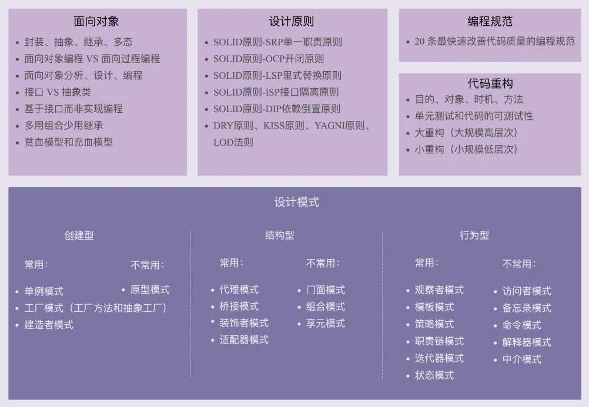

# patteern 

[c语言中文网设计模式](http://c.biancheng.net/view/8462.html)




## 设计模式主要是基于以下的面向对象设计原则。

+ 对接口编程而不是对实现编程。
+ 优先使用对象组合而不是继承。

这些模式可以分为三大类：

+ 创建型模式（Creational Patterns）
+ 结构型模式（Structural Patterns）
+ 行为型模式（Behavioral Patterns）

## 一，创建型模式

这些设计模式提供了一种在创建对象的同时隐藏创建逻辑的方式，而不是使用 new 运算符直接实例化对象。这使得程序在判断针对某个给定实例需要创建哪些对象时更加灵活。

+ 工厂方法（Factory Method）
+ 抽象工厂模式（Abstract Factory）
+ 单例模式（Singleton Pattern）
+ 建造者模式（Builder Pattern）
+ 原型模式（Prototype Pattern）

### 1.1.工厂方法(Factory Method)

工厂模式一般分为三种：简单工厂模式、工厂方法模式。

#### 参数化--工厂模式：  
**意图** ：定义一个创建对象的接口，让其子类自己决定实例化哪一个工厂类，工厂模式使其创建过程延迟到子类进行。  
**主要解决** ：主要解决接口选择的问题。  
**何时使用** ：我们明确地计划不同条件下创建不同实例时。  
**如何解决** ：让其子类实现工厂接口，返回的也是一个抽象的产品。  
**关键代码** ：创建过程在其子类执行。  

工厂类根据参数不同 创建有公共父类的不同对象，返回父类的指针。例子中是创建不同品牌的车。

```cpp
#include <iostream>
using namespace std;

enum CarType { BENZ, BMW };

class Car {
public:
  virtual void showLogo(void) = 0;
  virtual ~Car() {}
};

class BenzCar : public Car {
public:
  BenzCar() { cout << "Benz::Benz()" << endl; }
  virtual void showLogo(void) { cout << "BenzCar::showLogo()" << endl; }
  ~BenzCar() {}
};

class BmwCar : public Car {
public:
  BmwCar() { cout << "Bmw::Bmw()" << endl; }
  virtual void showLogo(void) { cout << "BmwCar::showLogo()" << endl; }
};

class CarFactory {
public:
  Car *createSpecificCar(CarType type) {
    switch (type) {
    case BENZ:
      return (new BenzCar());
      break;
    case BMW:
      return (new BmwCar());
      break;
    default:
      return NULL;
      break;
    }
  }
};

int main(int argc, char *argv[]) {
  CarFactory carfac;
  Car *carA = carfac.createSpecificCar(BENZ);
  carA->showLogo();
  Car *carB = carfac.createSpecificCar(BMW);
  carB->showLogo();

  delete carA;
  delete carB;
  return 0;
}
```
####  多态化--工厂方法模式：

简述：工厂类改为抽象类，由子类负责创建。

工厂方法模式：不再只由一个工厂类决定那一个产品类应当被实例化,这个决定权被交给子类去做。当有新的产品（新型汽车）产生时，只要按照抽象产品角色、抽象工厂角色提供的方法来生成即可（新车型可以用一个新类继承创建产品即可），那么就可以被客户使用，而不必去修改任何已有的代 码。可以看出工厂角色的结构也是符合开闭原则。

```cpp
#include <iostream>
using namespace std;

class Car {
public:
  virtual void createdCar(void) = 0;
  virtual ~Car() {}
};

class BenzCar : public Car {
public:
  BenzCar() { cout << "Benz::Benz()" << endl; }
  virtual void createdCar(void) { cout << "BenzCar::createdCar()" << endl; }
  ~BenzCar() {}
};

class BmwCar : public Car {
public:
  BmwCar() { cout << "Bmw::Bmw()" << endl; }
  virtual void createdCar(void) { cout << "BmwCar::createdCar()" << endl; }
};

class Factory {
public:
  virtual Car *createSpecificCar(void) = 0;
  virtual ~Factory() {}
};

class BenzFactory : public Factory {
public:
  virtual Car *createSpecificCar(void) { return (new BenzCar()); }
};

class BmwFactory : public Factory {
public:
  virtual Car *createSpecificCar(void) { return (new BmwCar()); }
};

int main(int argc, char **argv) {
  Factory *factory = new BenzFactory();
  Car *specificCarA = factory->createSpecificCar();
  factory = new BmwFactory();
  Car *specificCarB = factory->createSpecificCar();

  delete factory;
  delete specificCarA;
  delete specificCarB;

  return 0;
}
```

### 1.2.抽象工厂(Abstract Factory)

在上面的工厂方法模式基础上，有需要生产高配版的奔驰和宝马，那工厂方法模式就有点鞭长莫及了，这就又有抽象工厂模式

简述：指定品牌后可以创建多个类型的对象。

```cpp
#include <iostream>
using namespace std;

class Car {
public:
  virtual void createdCar(void) = 0;
  virtual ~Car() {}
};

class BenzCar : public Car {
public:
  BenzCar() { cout << "Benz::Benz()" << endl; }
  virtual void createdCar(void) { cout << "BenzCar::createdCar()" << endl; }
  ~BenzCar() {}
};

class BmwCar : public Car {
public:
  BmwCar() { cout << "Bmw::Bmw()" << endl; }
  virtual void createdCar(void) { cout << "BmwCar::createdCar()" << endl; }
};

class HighCar //高配版车型
{
public:
  virtual void createdCar(void) = 0;
  virtual ~HighCar() {}
};

class HighBenzCar : public HighCar {
public:
  HighBenzCar() { cout << "HighBenzCarBenz::Benz()" << endl; }
  virtual void createdCar(void) { cout << "HighBenzCar::createdCar()" << endl; }
};

class HighBmwCar : public HighCar {
public:
  HighBmwCar() { cout << "HighBmwCar::Bmw()" << endl; }
  virtual void createdCar(void) { cout << "HighBmwCar::createdCar()" << endl; }
};

class Factory {
public:
  virtual Car *createSpecificCar(void) = 0;
  virtual HighCar *createdSpecificHighCar(void) = 0;
  virtual ~Factory() {}
};

class BenzFactory : public Factory {
public:
  virtual Car *createSpecificCar(void) { return (new BenzCar()); }

  virtual HighCar *createdSpecificHighCar(void) { return (new HighBenzCar()); }
};

class BmwFactory : public Factory {
public:
  virtual Car *createSpecificCar(void) { return (new BmwCar()); }
  virtual HighCar *createdSpecificHighCar(void) { return (new HighBmwCar()); }
};

int main(int argc, char **argv) {
  Factory *factory = new BenzFactory();
  Car *specificCar = factory->createSpecificCar();
  HighCar *spcificHighCar = factory->createdSpecificHighCar();

  delete factory;
  delete specificCar;
  delete spcificHighCar;

  return 0;
}

```

### 1.3.单例模式(Singleton)
#### a.懒汉模式(堆-线程安全模式)
解决了线程安全与释放问题。

+ singleton.h

```cpp
#include <boost/noncopyable.hpp>
#include <pthread.h>
#include <stdio.h>
template<typename T>
struct has_no_destroy
{
  template <typename C> static char test(decltype(&C::no_destroy));
  template <typename C> static int32_t test(...);
  const static bool value = sizeof(test<T>(0)) == 1;
};

template <class T> class Singleton : boost ::noncopyable {
public:
  static T &instance() {
    pthread_once(&ponce_, &Singleton::init);
    return *value_;
  }

private:
  Singleton<T>() = delete;
  ~Singleton<T>() = delete;
  static void init() {
    value_ = new T();
    if (!has_no_destroy<T>::value) {
      ::atexit(destroy);
    }
  }
  static void destroy() {
    delete value_;
    value_ = NULL;
    puts("has delete!");
  }

  static pthread_once_t ponce_;
  static T *value_;
};
// template static var can be place at header
template <typename T> pthread_once_t Singleton<T>::ponce_ = PTHREAD_ONCE_INIT;
template <typename T> T *Singleton<T>::value_ = nullptr;

class NonTemplate {
  static int a;
};
// int NonTemplate::a=1; //multiple definition of `NonTemplate::a';
```

+ test.cpp

```cpp
#include "singleton.h"

class Base {
public:
  int a;
private:
  friend class Singleton<Base>;
  Base() = default;
};
int main() {
  Base &base = Singleton<Base>::instance();
  base.a = 1;
  return 0;
}
```

#### b.懒汉模式 (局部静态变量)

在 Instance() 函数内定义局部静态变量的好处是, theLog 的构造函数只会在第一次调用Instance() 时被初始化, 达到了和 "堆栈版" 相同的动态初始化效果, 保证了成员变量和 Singleton 本身的初始化顺序.

它还有一个潜在的安全措施, Instance() 返回的是对局部静态变量的引用, 如果返回的是指针, Instance() 的调用者很可能会误认为他要检查指针的有效性, 并负责销毁. 构造函数和拷贝构造函数也私有化了, 这样类的使用者不能自行实例化.

```cpp
#include <iostream>
#include <list>
class Log {
public:
  static Log &Instance() {
    static Log singletonLog;
    return singletonLog;
  }
  void Write(char const *logLine) { m_data.push_back(logLine); };
  void Print() {
    for (auto &line : m_data) {
      std::cout << line << std::endl;
    }
  }

private:
  Log() {};                     // ctor is hidden
  Log(Log const &);            // copy ctor is hidden
  Log &operator=(Log const &); // assign op is hidden
  std::list<std::string> m_data;
};
int main() {
  Log::Instance().Write("hello");
  Log::Instance().Print();
  return 0;
}
```


#### c.懒汉模式(堆-粗糙版)

(堆-粗糙版): 单例实例只在第一次被使用时进行初始化:

Instance() 只在第一次被调用时为 m_pInstance 分配内存并初始化. 嗯, 看上去所有的问题都解决了, 初始化顺序有保证, 多态也没问题. 程序退出时, 析构函数没被执行. 这在某些设计不可靠的系统上会导致资源泄漏, 比如文件句柄, socket 连接, 内存等等 对于这个问题, 比较土的解决方法是, 给每个 Singleton 类添加一个 destructor() 方法:

```cpp
#include <iostream>

class HeapObj {
public:
  static HeapObj *Instance() {
    if (!m_pInstance)
      m_pInstance = new HeapObj;
    return m_pInstance;
  }
  void Print() { std::cout << m_var << std::endl; }

private:
  HeapObj(){};                                // ctor is hidden
  HeapObj(HeapObj const &);            // copy ctor is hidden
  HeapObj &operator=(HeapObj const &); // assign op is hidden

  int m_var = 9;
  static HeapObj *m_pInstance;
};
HeapObj *HeapObj::m_pInstance = NULL;

int main() {
  HeapObj::Instance()->Print();
  return 0;
}
```

#### d.饿汉模式

是指单例实例在程序运行时被立即执行初始化:
这种模式的问题也很明显, 类现在是多态的, 但静态成员变量初始化顺序还是没保证.

```cpp
#include <iostream>
class ClassStaticObj {
public:
  static ClassStaticObj &Instance() { return m_instance; }
  void Print() { std::cout << m_var << std::endl; }

private:
  ClassStaticObj(){};                                // ctor is hidden
  ClassStaticObj(ClassStaticObj const &);            // copy ctor is hidden
  ClassStaticObj &operator=(ClassStaticObj const &); // assign op is hidden

  int m_var = 10;
  static ClassStaticObj m_instance;
};
// in log. cpp we have to declare
ClassStaticObj ClassStaticObj::m_instance;

int main() {
  ClassStaticObj::Instance().Print();
  return 0;
}
```

### 1.4.建造者模式（Builder）

+ 意图

将一个复杂对象的构建与表示分离，使得同样的构建过程可以创建不同的表示。

https://zhuanlan.zhihu.com/p/58093669

+ 使用
    1. 首先生成一个director  
    2. 然后生成一个目标builder  
    3. 接着使用director组装builder  
    4. 组装完毕后使用builder创建产品实例 


### 1.5.原型模式（Prototype）


+ 意图

用原型实例指定创建对象的种类，并且通过copy这些原型创建新的对象。


## 二，结构型模式  
这些设计模式关注类和对象的组合。继承的概念被用来组合接口和定义组合对象获得新功能的方式。

### 2.1 适配器模式（Adapter）
+ 意图  
将一个类的接口转换成客户希望的另外一个接口，使得原本由于接口不兼容而不能一起工作的那些类能一起工作。

+ c++ 实现  
用公共方式继承接口，用私有方式继承接口的实现

+ 与Bridge模式对比  
Bridge 的目的是将接口与实现分离，从而比较容易的独立改变它们，而Adapter意味着改变一个已有对象的接口。


### 2.2 桥接模式（Bridge）
+ 意图  
将抽象部分与它的实现分离，使它们可以独立的改变。

+ c++ 实现  
抽象类保存实现类的引用


### 2.3 组合模式（Composite）
### 2.4 装饰器模式（Decorator）
+ 意图  
动态的给一个对象添加额外的职责，就增加功能来说，Decorator 比生成子类更为灵活。

+ c++ 实现  
    1. 子类保存父类的引用，接口缺省调用父类的实现；
    2. 装饰的孙类重写父类的接口，在调用父类实现的同时增加自己的实现。`{dosomething(),Base::func()}`


### 2.5 外观模式（Facade）
### 2.6 享元模式（Flyweight）
### 2.7 代理模式（Proxy）
+ 意图  
为其他对象提供一种代理以控制对这个对象的访问。


## 三，行为型模式
这些设计模式特别关注对象之间的通信。

### 3.1 责任链模式（Chain of Responsibility）
+ 意图  
避免请求发送者与接收者耦合在一起，让多个对象都有可能接收请求，将这些对象连接成一条链，并且沿着这条链传递请求，直到有对象处理它为止。

### 3.2 命令模式（Command）
### 3.3 解释器模式（Interpreter）
### 3.4 迭代器模式（Iterator）
+ 意图  
提供一个方法顺序访问一个聚合对象中的各个元素，而又不需要暴露该对象的内部表示。

### 3.5 中介者模式（Mediator）
### 3.6 备忘录模式（Memento）
### 3.7 观察者模式（Observer）
+ 意图  
定义对象间的一种一对多的依赖关系，当一个对象的状态发生改变时，所有依赖它的对象都得到通知并自动更新。


当对象间存在一对多关系时，则使用观察者模式（Observer Pattern）。比如，当一个对象被修改时，则会自动通知依赖它的对象。观察者模式属于行为型模式。
### 3.8 状态模式（State）
+ 意图  
对有状态的对象，把复杂的“判断逻辑”提取到不同的状态对象中，允许状态对象在其内部状态发生改变时改变其行为。

### 3.9 策略模式（Strategy）
+ 意图  
该模式定义了一系列算法，并将每个算法封装起来，使它们可以相互替换，且算法的变化不会影响使用算法的客户。策略模式属于对象行为模式，它通过对算法进行封装，把使用算法的责任和算法的实现分割开来，并委派给不同的对象对这些算法进行管理。
### 3.10 模板模式（Template Method）
+ 意图  
定义一个操作中的算法骨架，而将算法的一些步骤延迟到子类中，使得子类可以不改变该算法结构的情况下重定义该算法的某些特定步骤。它是一种类行为型模式。


### 3.11 访问者模式（Visitor）
+ 意图  
将作用于某种数据结构中的各元素的操作分离出来封装成独立的类，使其在不改变数据结构的前提下可以添加作用于这些元素的新的操作，为数据结构中的每个元素提供多种访问方式。它将对数据的操作与数据结构进行分离，是行为类模式中最复杂的一种模式。


+ 空对象模式（Null Object Pattern）


## J2EE 模式

这些设计模式特别关注表示层。这些模式是由 Sun Java Center 鉴定的。

+ MVC 模式（MVC Pattern）
+ 业务代表模式（Business Delegate Pattern）
+ 组合实体模式（Composite Entity Pattern）
+ 数据访问对象模式（Data Access Object Pattern）
+ 前端控制器模式（Front Controller Pattern）
+ 拦截过滤器模式（Intercepting Filter Pattern）
+ 服务定位器模式（Service Locator Pattern）
+ 传输对象模式（Transfer Object Pattern）


##  面向对象五个基本原则（SOLID）

### ● Single Responsibility Principle：单一职责原则
定义：

就一个类而言，应该仅有一个引起它变化的原因。应该只有一个职责。 [1]  每一个职责都是变化的一个轴线，如果一个类有一个以上的职责，这些职责就耦合在了一起。这会导致脆弱的设计。当一个职责发生变化时，可能会影响其它的职责。另外，多个职责耦合在一起，会影响复用性。例如：要实现逻辑和界面的分离。

单一职责原则好处： 

*  类的复杂性降低，实现什么职责都有清晰明确的定义；
*  可读性提高，复杂性降低，那当然可读性提高了； 
* 变更引起的风险降低，变更是必不可少的，如果接口的单一职责做得好，一个接口修改只对相应的实现类有影响，对其他的接口无影响，这对系统的扩展性、维护性都有非常大的帮助。
 
### ● Liskov Substitution Principle：里氏替换原则
定义：Functions that use pointers or references to base classes must be able to use objects of derived classes without knowing it.
（所有引用基类的地方必须能透明地使用其子类的对象。）

通俗点讲，只要父类能出现的地方子类就可以出现，而且替换为子类也不会产生任何错误或异常，使用者可能根本就不需要知道是父类还是子类。但是，反过来就不行了，有子类出现的地方，父类未必就能适应。
定义中包含的四层含义：

1. 子类必须完全实现父类的方法
2. 子类可以有自己的个性
3. 覆盖或实现父类的方法时输入参数可以被放大
        如果父类的输入参数类型大于子类的输入参数类型，会出现父类存在的地方，子类未必会存在，因为一旦把子类作为参数传入，调用者很可能进入子类的方法范畴。
 
4. 覆写或实现父类的方法时输出结果可以被缩小
      父类的一个方法的返回值是一个类型T，子类的相同方法（重载或覆写）的返回值为S，那么里氏替换原则就要求S必须小于等于T，也就是说，要么S和T是同一个类型，要么S是T的子类。
### ● Interface Segregation Principle：接口隔离原则
 使用多个专门的接口比使用单一的总接口要好。
一个类对另外一个类的依赖性应当是建立在最小的接口上的。
一个接口代表一个角色，不应当将不同的角色都交给一个接口。没有关系的接口合并在一起，形成一个臃肿的大接口，这是对角色和接口的污染。

隔离：建立单一接口，不要建立臃肿庞大的接口；即接口要尽量细化，同时接口中的方法要尽量少。

### ● Dependence Inversion Principle：依赖倒置原则
原始定义：

* ①高层模块不应该依赖低层模块，两者都应该依赖其抽象； 
* ②抽象不应该依赖细节（实现类）
* ③细节应该依赖抽象。

依赖倒置原则在java语言中的体现：
①模块间的依赖通过抽象发生，实现类之间不发生直接的依赖关系，其依赖关系是通过接口或抽象类产生的；
②接口或抽象类不依赖于实现类；
③实现类依赖接口或抽象类。

依赖的三种写法：
①构造函数传递依赖对象（构造函数注入）
②Setter方法传递依赖对象（setter依赖注入）
③接口声明依赖对象（接口注入）

使用原则：
依赖倒置原则的本质就是通过抽象（接口或抽象类）使各个类或模块的实现彼此独立，不互相影响，实现模块间的松耦合，我们怎么在项目中使用这个规则呢？只要遵循以下的几个规则就可以：
①每个类尽量都有接口或抽象类，或者抽象类和接口两者都具备
②变量的表面类型尽量是接口或者是抽象类
③任何类都不应该从具体类派生（只要不超过两层的继承是可以忍受的）
④尽量不要复写基类的方法
⑤结合里氏替换原则使用
 
 
### ●Open Closed Principle：开闭原则

在面向对象编程领域中，开闭原则规定“软件中的对象（类，模块，函数等等）应该 **对于扩展是开放的，但是对于修改是封闭的** ”，这意味着一个实体是允许在不改变它的源代码的前提下变更它的行为。该特性在产品化的环境中是特别有价值的，在这种环境中，改变源代码需要代码审查，单元测试以及诸如此类的用以确保产品使用质量的过程。遵循这种原则的代码在扩展时并不发生改变，因此无需上述的过程。

