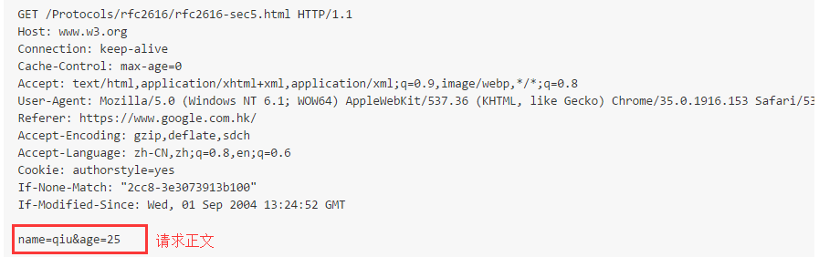
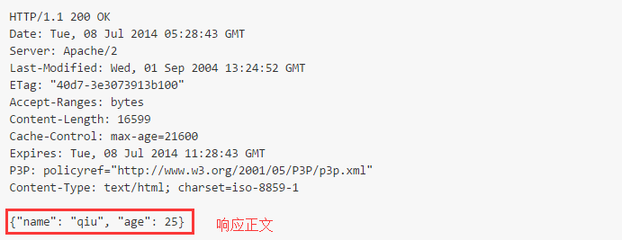

[toc]

# [http](https://www.cnblogs.com/an-wen/p/11180076.html)

## HTTP 发展史

|版本 | 时间| 内容| 发展现状|
|--|--|--|--|
| HTTP.09 | 1991 |只支持GET请求，并且不支持请求头|已经过时
| [HTTP1.0](https://tools.ietf.org/html/rfc1945) | 1996 | HTTP1.0版本虽然是支持长链接，但是默认情况还是短连接，需要使用keep-alive参数来告知服务器建立一个长链接| 今仍然被广泛使用，尤其是在代理服务器中。
| [HTTP1.1](https://tools.ietf.org/html/rfc2616) | 1997 | 1.引入了长链接,2.节约带宽,3.1.1版本中增加了host处理  |最流行的一个版本
| [HTTP2 ](https://tools.ietf.org/html/rfc7540) | 2015 | 1.多路复用, 2.引入了二进制格式 3.服务器推送| 目前用的比较少 
| [HTTPS ](https://tools.ietf.org/html/rfc2818) | 2000 |  HTTP Over TLS

---

## HTTP协议简介

超文本传输协议（英文：HyperText Transfer Protocol，缩写：HTTP）是一种用于分布式、协作式和超媒体信息系统的应用层协议。HTTP是万维网的数据通信的基础。

HTTP的发展是由蒂姆·伯纳斯-李于1989年在欧洲核子研究组织（CERN）所发起。HTTP的标准制定由万维网协会（World Wide Web Consortium，W3C）和互联网工程任务组（Internet Engineering Task Force，IETF）进行协调，最终发布了一系列的RFC，其中最著名的是1999年6月公布的 RFC 2616，定义了HTTP协议中现今广泛使用的一个版本——HTTP 1.1。

2014年12月，互联网工程任务组（IETF）的Hypertext Transfer Protocol Bis（httpbis）工作小组将HTTP/2标准提议递交至IESG进行讨论，于2015年2月17日被批准。 HTTP/2标准于2015年5月以RFC 7540正式发表，取代HTTP 1.1成为HTTP的实现标准。
## HTTP协议概述
HTTP是一个客户端终端（用户）和服务器端（网站）请求和应答的标准（TCP）。通过使用网页浏览器、网络爬虫或者其它的工具，客户端发起一个HTTP请求到服务器上指定端口（默认端口为80）。我们称这个客户端为用户代理程序（user agent）。应答的服务器上存储着一些资源，比如HTML文件和图像。我们称这个应答服务器为源服务器（origin server）。在用户代理和源服务器中间可能存在多个“中间层”，比如代理服务器、网关或者隧道（tunnel）。

尽管TCP/IP协议是互联网上最流行的应用，HTTP协议中，并没有规定必须使用它或它支持的层。事实上，HTTP可以在任何互联网协议上，或其他网络上实现。HTTP假定其下层协议提供可靠的传输。因此，任何能够提供这种保证的协议都可以被其使用。因此也就是其在TCP/IP协议族使用TCP作为其传输层。

通常，由HTTP客户端发起一个请求，创建一个到服务器指定端口（默认是80端口）的TCP连接。HTTP服务器则在那个端口监听客户端的请求。一旦收到请求，服务器会向客户端返回一个状态，比如"HTTP/1.1 200 OK"，以及返回的内容，如请求的文件、错误消息、或者其它信息。

## HTTP工作原理
HTTP协议定义Web客户端如何从Web服务器请求Web页面，以及服务器如何把Web页面传送给客户端。HTTP协议采用了请求/响应模型。客户端向服务器发送一个请求报文，请求报文包含请求的方法、URL、协议版本、请求头部和请求数据。服务器以一个状态行作为响应，响应的内容包括协议的版本、成功或者错误代码、服务器信息、响应头部和响应数据。

以下是 HTTP 请求/响应的步骤：

\1. 客户端连接到Web服务器
一个HTTP客户端，通常是浏览器，与Web服务器的HTTP端口（默认为80）建立一个TCP套接字连接。例如，http://www.luffycity.com。

\2. 发送HTTP请求
通过TCP套接字，客户端向Web服务器发送一个文本的请求报文，一个请求报文由请求行、请求头部、空行和请求数据4部分组成。

\3. 服务器接受请求并返回HTTP响应
Web服务器解析请求，定位请求资源。服务器将资源复本写到TCP套接字，由客户端读取。一个响应由状态行、响应头部、空行和响应数据4部分组成。

\4. 释放连接TCP连接
若connection 模式为close，则服务器主动关闭TCP连接，客户端被动关闭连接，释放TCP连接;若connection 模式为keepalive，则该连接会保持一段时间，在该时间内可以继续接收请求;

\5. 客户端浏览器解析HTML内容
客户端浏览器首先解析状态行，查看表明请求是否成功的状态代码。然后解析每一个响应头，响应头告知以下为若干字节的HTML文档和文档的字符集。客户端浏览器读取响应数据HTML，根据HTML的语法对其进行格式化，并在浏览器窗口中显示。

例如：在浏览器地址栏键入URL，按下回车之后会经历以下流程：

浏览器向 DNS 服务器请求解析该 URL 中的域名所对应的 IP 地址;
解析出 IP 地址后，根据该 IP 地址和默认端口 80，和服务器建立TCP连接;
浏览器发出读取文件(URL 中域名后面部分对应的文件)的HTTP 请求，该请求报文作为 TCP 三次握手的第三个报文的数据发送给服务器;
服务器对浏览器请求作出响应，并把对应的 html 文本发送给浏览器;
释放 TCP连接;
浏览器将该 html 文本并显示内容; 　

## HTTP请求方法
HTTP/1.1协议中共定义了八种方法（也叫“动作”）来以不同方式操作指定的资源：

1. **GET** 向指定的资源发出“显示”请求。使用GET方法应该只用在读取数据，而不应当被用于产生“副作用”的操作中，例如在Web Application中。其中一个原因是GET可能会被网络蜘蛛等随意访问。

2. **HEAD** 与GET方法一样，都是向服务器发出指定资源的请求。只不过服务器将不传回资源的本文部分。它的好处在于，使用这个方法可以在不必传输全部内容的情况下，就可以获取其中“关于该资源的信息”（元信息或称元数据）。

3. **POST** 向指定资源提交数据，请求服务器进行处理（例如提交表单或者上传文件）。数据被包含在请求本文中。这个请求可能会创建新的资源或修改现有资源，或二者皆有。

4. **PUT** 向指定资源位置上传其最新内容。

5. **DELETE** 请求服务器删除Request-URI所标识的资源。

6. **TRACE** 回显服务器收到的请求，主要用于测试或诊断。

7. **OPTIONS** 这个方法可使服务器传回该资源所支持的所有HTTP请求方法。用'*'来代替资源名称，向Web服务器发送OPTIONS请求，可以测试服务器功能是否正常运作。

8. **CONNECT** HTTP/1.1协议中预留给能够将连接改为管道方式的代理服务器。通常用于SSL加密服务器的链接（经由非加密的HTTP代理服务器）。

### 注意事项：

方法名称是区分大小写的。当某个请求所针对的资源不支持对应的请求方法的时候，服务器应当返回状态码405（Method Not Allowed），当服务器不认识或者不支持对应的请求方法的时候，应当返回状态码501（Not Implemented）。
HTTP服务器至少应该实现GET和HEAD方法，其他方法都是可选的。当然，所有的方法支持的实现都应当匹配下述的方法各自的语义定义。此外，除了上述方法，特定的HTTP服务器还能够扩展自定义的方法。例如PATCH（由 RFC 5789 指定的方法）用于将局部修改应用到资源。
请求方式: get与post请求（通过form表单我们自己写写看）
GET提交的数据会放在URL之后，也就是请求行里面，以?分割URL和传输数据，参数之间以&相连，如EditBook?name=test1&id=123456.（请求头里面那个content-type做的这种参数形式，后面讲） POST方法是把提交的数据放在HTTP包的请求体中.

GET提交的数据大小有限制（因为浏览器对URL的长度有限制），而POST方法提交的数据没有限制.

GET与POST请求在服务端获取请求数据方式不同，就是我们自己在服务端取请求数据的时候的方式不同了，这句废话昂。

## http 请求格式

请求报文由4个部分组成，它们分别是**请求行、请求头部、空行和报文主体**；请求行、请求头部和空行是必需的而报文主体是可选的。

## http 响应格式

响应报文也由4个部分组成，它们分别是**状态行、响应头部、空行和报文主体**；状态行、响应头部和空行是必需的而报文主体是可选的。

## 响应码

+ 2xx:成功响应码
+ 3xx:重定向
+ 4xx:客服端错误
+ 5xx:服务端错误

作者：wavesnow
链接：https://www.jianshu.com/p/d4767b797e57

+ 1.0 状态码：

| Status-Code    | res|
| -- | -- |
| "200"   | OK
| "201"   | Created|
| "202"   | Accepted|
| "204"   | No Content|
| "301"   | Moved Permanently|
| "302"   | Moved Temporarily|
| "304"   | Not Modified|
| "400"   | Bad Request|
| "401"   | Unauthorized|
| "403"   | Forbidden|
| "404"   | Not Found|
| "500"   | Internal Server Error|
| "501"   | Not Implemented|
| "502"   | Bad Gateway|
| "503"   | Service Unavailable|
