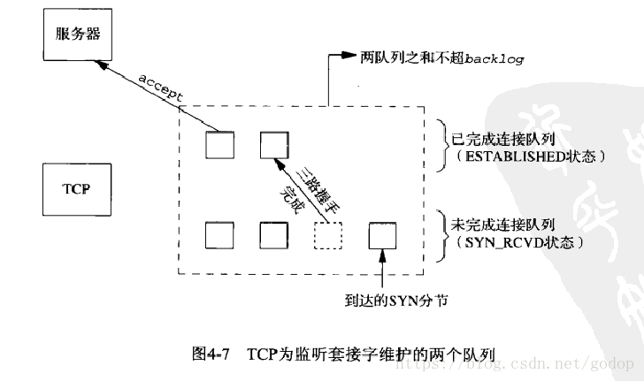

[toc]

#

## 进程

内核把进程的列表放在叫做任务队列的双向循环链表中，每个节点是进程描述符定义在<linux/sched.h>,描述了一个正在执行的程序：打开的文件，地址空间，挂起信号，进程的状态···。

### 进程的5种状态

+ TASK_RUNNING (运行)---进程是可执行的，它要么在执行，要么在运行队列中等待执行，
+ TASK_INTERRUPTIBLE(可中断)---正在睡眠或说是阻塞，一旦条件达成，就投入运行。收到信号可能提前被唤醒。
+ TASK_UNINTERRUPTIBLE(不可中断)--- 收到信号也不会准备投入运行，这个状态出现在进程等待时不能受到干扰，或者等待条件很快就会出现。处于这个状态的进程对信号不做响应。
+ TASK_TRACED ---被其它程序跟踪的进程，如ptrace对调试程序跟踪
+ TASK_STOPPED(停止) ---停止执行，没有运行也不能运行，这个状态发生在收到:SIGSTOP,SIGTSTP,SIGTTIN,SIGTTOU 等信号的时候，在调试期间收到任何信号都会让程序进入这个状态。

### 僵尸进程
子进程已经退出，父进程未退出，也没有处理子进程退出的信号，则子进程的task_struct不会销毁。
目的是:维护子进程信息，供父进程后续获取，信息包括（PID，终止状态，资源利用），有些UNIX的ps命令的COMMAND栏：以`<defunct>`表示僵尸进程，
有些linux系统state栏，以`Z`表示僵尸进程。

### 孤儿进程
父进程先于子进程退出

## 协程
协程是一种用户态的轻量级线程。本篇主要研究协程的C/C++的实现。
首先我们可以看看有哪些语言已经具备协程语义：

* 比较重量级的有C#、erlang、golang*
* 轻量级有python、lua、javascript、ruby
* 还有函数式的scala、scheme等。

c/c++不直接支持协程语义，但有不少开源的协程库，如：

*  Protothreads：[一个“蝇量级” C 语言协程库](https://coolshell.cn/articles/10975.html)
*  libco:[来自腾讯的开源协程库libco介绍](https://www.cnblogs.com/bangerlee/p/4003160.html)，官网
*  coroutine:[云风的一个C语言同步协程库](https://github.com/cloudwu/coroutine/),[详细信息](https://blog.codingnow.com/2012/07/c_coroutine.html)

 目前看到大概有四种实现协程的方式：

* 第一种：利用glibc 的 ucontext组件(云风的库)
* 第二种：使用汇编代码来切换上下文[实现c协程](https://www.cnblogs.com/sniperHW/archive/2012/06/19/2554574.html)
* 第三种：利用C语言语法switch-case的奇淫技巧来实现（Protothreads)
* 第四种：利用了 C 语言的 setjmp 和 longjmp（ [一种协程的 C/C++ 实现](https://www.cnblogs.com/Pony279/p/3903048.html),要求函数里面使用 static local 的变量来保存协程内部的数据）

### 使用glibc 中的ucontext来实现简单的协程库
利用ucontext提供的四个函数getcontext(),setcontext(),makecontext(),swapcontext()可以在一个进程中实现用户级的线程切换。

 本节我们先来看ucontext实现的一个简单的例子：
```
#include <stdio.h>
#include <ucontext.h>
#include <unistd.h>
 
int main(int argc, const char *argv[]){
    ucontext_t context;
 
    getcontext(&context);
    puts("Hello world");
    sleep(1);
    setcontext(&context);
    return 0;
}
```
想想程序运行的结果会是什么样？
```
cxy@ubuntu:~$ ./example 
Hello world
Hello world
Hello world
Hello world
^C
cxy@ubuntu:~$
```
上面是程序执行的部分输出，不知道是否和你想得一样呢？我们可以看到，程序在输出第一个“Hello world"后并没有退出程序，而是持续不断的输出”Hello world“。其实是程序通过getcontext先保存了一个上下文,然后输出"Hello world",在通过setcontext恢复到getcontext的地方，重新执行代码，所以导致程序不断的输出”Hello world“，在我这个菜鸟的眼里，这简直就是一个神奇的跳转。

那么问题来了，ucontext到底是什么？

### ucontext组件到底是什么
 在类System V环境中,在头文件< ucontext.h > 中定义了两个结构类型，mcontext_t和ucontext_t和四个函数getcontext(),setcontext(),makecontext(),swapcontext().利用它们可以在一个进程中实现用户级的线程切换。

mcontext_t类型与机器相关，并且不透明.ucontext_t结构体则至少拥有以下几个域:
```
   typedef struct ucontext {
       struct ucontext *uc_link;
       sigset_t         uc_sigmask;
       stack_t          uc_stack;
       mcontext_t       uc_mcontext;
       ...
   } ucontext_t;
```
 当当前上下文(如使用makecontext创建的上下文）运行终止时系统会恢复uc_link指向的上下文；uc_sigmask为该上下文中的阻塞信号集合；uc_stack为该上下文中使用的栈；uc_mcontext保存的上下文的特定机器表示，包括调用线程的特定寄存器等。

 下面详细介绍四个函数：

`int getcontext(ucontext_t *ucp);`

 初始化ucp结构体，将当前的上下文保存到ucp中

`int setcontext(const ucontext_t *ucp);`

 设置当前的上下文为ucp，setcontext的上下文ucp应该通过getcontext或者makecontext取得，如果调用成功则不返回。如果上下文是通过调用getcontext()取得,程序会继续执行这个调用。如果上下文是通过调用makecontext取得,程序会调用makecontext函数的第二个参数指向的函数，如果func函数返回,则恢复makecontext第一个参数指向的上下文第一个参数指向的上下文context_t中指向的uc_link.如果uc_link为NULL,则线程退出。

`void makecontext(ucontext_t *ucp, void (*func)(), int argc, ...);`

 makecontext修改通过getcontext取得的上下文ucp(这意味着调用makecontext前必须先调用getcontext)。然后给该上下文指定一个栈空间ucp->stack，设置后继的上下文ucp->uc_link.

 当上下文通过setcontext或者swapcontext激活后，执行func函数，argc为func的参数个数，后面是func的参数序列。当func执行返回后，继承的上下文被激活，如果继承上下文为NULL时，线程退出。

`int swapcontext(ucontext_t *oucp, ucontext_t *ucp);`

保存当前上下文到oucp结构体中，然后激活upc上下文。 

如果执行成功，getcontext返回0，setcontext和swapcontext不返回；如果执行失败，getcontext,setcontext,swapcontext返回-1，并设置对于的errno.

简单说来，  `getcontext`获取当前上下文，`setcontext`设置当前上下文，`swapcontext`切换上下文，`makecontext`创建一个新的上下文。


--------

## linux命令
### ps

To see every process on the system using standard syntax:
```
  ps -e
  ps -ef
  ps -eF
  ps -ely
```
To see every process on the system using BSD syntax:

```
  ps ax
  ps axu
```
* linux上进程有5种状态:

1. 运行(正在运行或在运行队列中等待)
2. 中断(休眠中, 受阻, 在等待某个条件的形成或接受到信号)
3. 不可中断(收到信号不唤醒和不可运行, 进程必须等待直到有中断发生)
4. 僵死(进程已终止, 但进程描述符存在, 直到父进程调用wait4()系统调用后释放)
5. 停止(进程收到SIGSTOP, SIGSTP, SIGTIN, SIGTOU信号后停止运行运行)

* ps工具标识进程的5种状态码:

* D 不可中断 uninterruptible sleep (usually IO)
* R 运行 runnable (on run queue)
* S 中断 sleeping
* T 停止 traced or stopped
* Z 僵死 a defunct (”zombie”) process

To print a process tree:
```
  ps -ejH
  ps axjf
```
To get info about threads:
```
  ps -eLf
  ps axms
```
To get security info:
```
  ps -eo euser,ruser,suser,fuser,f,comm,label
  ps axZ
  ps -eM
```
#### pstree
以进程树的形式查看进程

#### PROCESS STATE CODES         top
       Here are the different values that the s, stat and state output
       specifiers (header "STAT" or "S") will display to describe the state
       of a process:

               D    uninterruptible sleep (usually IO)
               I    Idle kernel thread
               R    running or runnable (on run queue)
               S    interruptible sleep (waiting for an event to complete)
               T    stopped by job control signal
               t    stopped by debugger during the tracing
               W    paging (not valid since the 2.6.xx kernel)
               X    dead (should never be seen)
               Z    defunct ("zombie") process, terminated but not reaped by
                    its parent

       For BSD formats and when the stat keyword is used, additional
       characters may be displayed:

               <    high-priority (not nice to other users)
               N    low-priority (nice to other users)
               L    has pages locked into memory (for real-time and custom
                    IO)
               s    is a session leader
               l    is multi-threaded (using CLONE_THREAD, like NPTL
                    pthreads do)
               +    is in the foreground process group


#### top

#### kill

### objdump


#### objdump反汇编常用参数
objdump -d <file(s)>: 将代码段反汇编；
objdump -S <file(s)>: 将代码段反汇编的同时，将反汇编代码与源代码交替显示，编译时需要使用-g参数，即需要调试信息；
objdump -C <file(s)>: 将C++符号名逆向解析
objdump -l <file(s)>: 反汇编代码中插入文件名和行号
objdump -j section <file(s)>: 仅反汇编指定的section

#### 显示main.c的汇编代码
gcc -S -o main.s main.c


#### 目标文件反汇编
gcc -c -o main.o main.c
objdump -s -d main.o > main.o.txt

### nm命令

nm是names的缩写， nm命令主要是用来列出某些文件中的符号（说白了就是一些函数和全局变量等）

语法格式
nm [参数]
常用选项：

-A    每个符号前显示文件名
-D    显示动态符号
-g    仅显示外部符号
-r    反序显示符号表

### netstat
#### 查询TCP各个状态的fd数量
`netstat -ant|awk '/^tcp/ {++S[$NF]} END {for(a in S) print (a,S[a])}'`

### lsof


`lsof -i:2007`

----

### nc

https://www.cnblogs.com/bakari/p/10898604.html

#### usage
```
usage: nc [-46CDdFhklNnrStUuvZz] [-I length] [-i interval] [-M ttl]
      [-m minttl] [-O length] [-P proxy_username] [-p source_port]
      [-q seconds] [-s source] [-T keyword] [-V rtable] [-W recvlimit] [-w timeout]
      [-X proxy_protocol] [-x proxy_address[:port]]       [destination] [port]
```

注：目的ip和端口在命令的最后，不加选项(-p 指定源端口可省略)。
#### 常用选项：

    -4：只使用 IPv4 地址
    -6：只使用 IPv6 地址
    -l：启动本地监听
    -n：不使用 DNS 解析
    -p：指定源端口
    -s：指定源 IP 地址
    -u：使用 UDP，默认是 TCP
    -v：显示详细信息
    -w：设定超时时间（只适合用在 Client 端）
    -d：禁止从标准输入读取数据，也就是客户端输入数据不会发送到服务端
    -k：让服务端保持连接，不断开

#### 建立 C/S 聊天室#

nc 的本质是在两台机器之间建立连接，之后就可以基于这个连接做很多事情，数据传输是其中一个最为基本的。我们下面就使用 nc 来建立一个 C/S 的聊天室。

+ 模拟 Server 端：
```
# -v ：输出详细信息
# -l ：指定监听地址和端口
nc -v -l 127.0.0.1 6000
```
+ 模拟 Client 端：
```
# -p : 指定源端口
nc -v -p 5000 localhost 6000
```
之后，Client 和 Server 端就可以相互聊天了。

#### transport file

+ 模拟 recv 端：
```
# 监听 all addr
nc -l 0.0.0.0 8000 >filename
```

+ 模拟 send 端：
```
nc -v 121.4.107.187 8000 <filename
```


### tcpdump

` sudo tcpdump -i eth0 port 8888 -vv `

#### 查看本地流量

` sudo tcpdump -i lo port 8888 -vv `

#### 查看指定协议的流量

```
sudo tcpdump udp -i eth0 -vv 
sudo tcpdump tcp -i eth0 -vv
sudo tcpdump icmp -i eth0 -vv
```

#### 查看HTTP GET请求
`sudo tcpdump -s 0 -A 'tcp dst port 80 and tcp[((tcp[12:1] & 0xf0) >> 2):4] = 0x47455420'`

#### 查看HTTP POST请求
`sudo tcpdump -s 0 -A 'tcp dst port 80 and (tcp[((tcp[12:1] & 0xf0) >> 2):4] = 0x504f5354)'`

#### 查看HTTP请求响应头以及数据
`sudo tcpdump -A -s 0 'tcp port 80 and (((ip[2:2] - ((ip[0]&0xf)<<2)) - ((tcp[12]&0xf0)>>2)) != 0)'`
`sudo tcpdump -X -s 0 'tcp port 80 and (((ip[2:2] - ((ip[0]&0xf)<<2)) - ((tcp[12]&0xf0)>>2)) != 0)'`


https://www.cnblogs.com/bakari/p/10748721.html
https://blog.csdn.net/u014481096/article/details/80257404

### df
### fdisk
### ifconfig

### uname

常用 `uname -a`
```
 -a, --all
        print all information, in the following order, except omit -p and -i if unknown:

 -s, --kernel-name
        print the kernel name

 -n, --nodename
        print the network node hostname

 -r, --kernel-release
        print the kernel release

 -v, --kernel-version
        print the kernel version

 -m, --machine
        print the machine hardware name

 -p, --processor
        print the processor type (non-portable)

 -i, --hardware-platform
        print the hardware platform (non-portable)

 -o, --operating-system
        print the operating system

```

### ipcs

```
 Resource options
     -m, --shmems
            Write information about active shared memory segments.

     -q, --queues
            Write information about active message queues.

     -s, --semaphores
            Write information about active semaphore sets.

     -a, --all
            Write information about all three resources (default).

```

#### ipcrm

```
  -a, --all [shm] [msg] [sem]
         Remove  all resources.  When an option argument is provided, the removal is performed only for the specified resource types.  Warning!
         Do not use -a if you are unsure how the software using the resources might react to missing objects.  Some programs create  these  re‐
         sources at startup and may not have any code to deal with an unexpected disappearance.

  -M, --shmem-key shmkey
         Remove the shared memory segment created with shmkey after the last detach is performed.

  -m, --shmem-id shmid
         Remove the shared memory segment identified by shmid after the last detach is performed.

  -Q, --queue-key msgkey
         Remove the message queue created with msgkey.

  -q, --queue-id msgid
         Remove the message queue identified by msgid.

  -S, --semaphore-key semkey
         Remove the semaphore created with semkey.

  -s, --semaphore-id semid
         Remove the semaphore identified by semid.
```

## linux大小端问题

1. Little-Endian就是低位字节排放在内存的低地址端，高位字节排放在内存的高地址端。
2. Big-Endian就是高位字节排放在内存的低地址端，低位字节排放在内存的高地址端。

举一个例子，比如数字高位在左边 0x12 34 56 78在内存中的表示形式为：

1. 大端模式：高位也在左边，阅读顺序一致，高位低地址
```
低地址 -----------------> 高地址
0x12  |  0x34  |  0x56  |  0x78
```

2. 小端模式：
```
低地址 ------------------> 高地址
0x78  |  0x56  |  0x34  |  0x12
```

### 大端小端各自优势：
1. 小端模式 ：强制转换数据不需要调整字节内容，1、2、4字节的存储方式一样。
2. 大端模式 ：符号位的判定固定为第一个字节，容易判断正负。


一般操作系统都是小端，而通讯协议是大端的。

常见CPU的字节序
Big Endian : PowerPC、IBM、Sun
Little Endian : x86、DEC
ARM既可以工作在大端模式，也可以工作在小端模式。
```
BOOL GetEndian()
{
    int a = 0x1234;
    //通过将int强制类型转换成char单字节，通过判断起始存储位置。即等于 取b等于a的低地址部分
    char b =  *(char *)&a;
    if( b == 0x12)
    {
        return BigEndian;
    }
    return SmallEndian;
}
```
联合体union的存放顺序是所有成员都从低地址开始存放，利用该特性可以轻松地获得了CPU对内存采用Little-endian还是Big-endian模式读写：
```
BOOL IsBigEndian()
{
    union NUM
    {
        int a;
        char b;
    }num;
    num. a = 0x1234;
    if( num. b == 0x12 )
    {
        return TRUE;
    }
    return FALSE;
}
```


## linux 网络编程


### [络编程之listen函数](https://blog.csdn.net/godop/article/details/79894079)
```
SYNOPSIS
       #include <sys/types.h>          /* See NOTES */
       #include <sys/socket.h>

       int listen(int sockfd, int backlog);
DESCRIPTION
       listen()  marks  the  socket  referred to by sockfd as a passive socket, that is, as a socket that will be used to accept incoming connection re‐
       quests using accept(2).

       The sockfd argument is a file descriptor that refers to a socket of type SOCK_STREAM or SOCK_SEQPACKET.

       The backlog argument defines the maximum length to which the queue of pending connections for sockfd may grow.  If a connection  request  arrives
       when  the  queue  is full, the client may receive an error with an indication of ECONNREFUSED or, if the underlying protocol supports retransmis‐
       sion, the request may be ignored so that a later reattempt at connection succeeds.

RETURN VALUE
       On success, zero is returned.  On error, -1 is returned, and errno is set appropriately.
```





### recv/recvfrom/recvmsg

```
SYNOPSIS
       #include <sys/types.h>
       #include <sys/socket.h>

       ssize_t recv(int sockfd, void *buf, size_t len, int flags);

       ssize_t recvfrom(int sockfd, void *buf, size_t len, int flags,
                        struct sockaddr *src_addr, socklen_t *addrlen);

       ssize_t recvmsg(int sockfd, struct msghdr *msg, int flags);
```

## 内存泄漏排查

### 一、c++ 重载new/delete操作符
重载new/delete操作符，用list或者map记录对内存的使用情况。new一次，保存一个节点，delete一次，就删除节点。
最后检测容器里是否还有节点，如果有节点就是有泄漏。也可以记录下哪一行代码分配的内存被泄漏。
类似的方法：在每次调用new时加个打印，每次调用delete时也加个打印。

### 二、使用mtrace/muntrace
linux 提供mtrace/muntrace来检测程序是否有内存泄露。一般来说要检测哪一段代码是否有内存泄露，就可以用这一对函数包起来。 
每一对malloc-free的执行，若每一个malloc都有相应的free，则代表没有内存泄露，对于任何非malloc/free情況下所发生的内存泄露问题，mtrace并不能找出来。   
在使用mtrace之前，先要设置一个环境变量“MALLOC_TRACE”来指定mtrace检测结果的生成文件名。通过此文件就可以看出代码是否有内存泄露。

```cpp
#include <mcheck.h>
#include <stdlib.h>
#include <stdio.h>

// int setenv(const char *name, const char *value, int overwrite);
int main(void) {
  setenv("MALLOC_TRACE", "./mtrace_output", 1);
  mtrace();
  int *p1 = (int *)malloc(10);
  int *p2 = (int *)malloc(10);
  printf("p1:%p\n",p1);
  printf("p2:%p\n",p2);
  free(p1);
  muntrace();
  return 0;
}
```
运行test_mtrace，就会生成指定文件mtrace_output.此文件是一个txt类型。

用mtrace命令分析mtrace的log文件：`mtrace [binary] mtrace_output`。
就会将output_file_name的內容转化成能被理解的语句。

### 三、查看进程maps表
在实际调试过程中，怀疑某处发生了内存泄漏，可以查看该进程的maps表，看进程的堆或mmap段的虚拟地址空间是否持续增加。如果是，说明可能发生了内存泄漏。如果mmap段虚拟地址空间持续增加，还可以看到各个段的虚拟地址空间的大小，从而可以确定是申请了多大的内存。

进程分配内存有两种方式，分别由两个系统调用完成：brk和mmap（不考虑共享内存）。
  1、brk是将数据段(.data)的最高地址指针_edata往高地址推 
  2、mmap是在进程的虚拟地址空间中（堆和栈中间，称为文件映射区域的地方）找一块空闲的虚拟内存。
  3. malloc小于128k的内存，使用brk分配内存
cat /proc/$pid/maps
[heap] 对应的行是data数据段的范围，如果使用brk调用，右侧的值会增加
[heap] 下面一个无标签的行是mmap分配内存的范围，左侧值随着mmap的调用减小
```cpp
#include <stdio.h>
#include <stdlib.h>
#include <string.h>
#include <unistd.h>
#include <malloc.h>
#define SIZE 1024 * 100

int main() {
  //在进程启动时候，加入以下两行代码：
  mallopt(M_MMAP_MAX, 0); // 禁止malloc调用mmap分配内存
  mallopt(M_TRIM_THRESHOLD, -1); // 禁止内存紧缩

  printf("pid: %d\n", getpid());
  void *p = NULL;
  while (1) {
    printf("cur:%p\n", sbrk(0));
    p = malloc(SIZE);
    sleep(5);
  }
  return 0;
}
```

### 四、valgrind工具, 以及gcc 提供的ASan
[AddressSanitizer](https://github.com/google/sanitizers/wiki/AddressSanitizer) is a part of LLVM starting with version 3.1 and a part of GCC starting with version 4.8  
AddressSanitizer (aka ASan) is a memory error detector for C/C++. It finds:   

1. Use after free (dangling pointer dereference)
1. Heap buffer overflow
1. Stack buffer overflow
1. Global buffer overflow
1. Use after return
1. Use after scope
1. Initialization order bugs
1. Memory leaks

#### 使用方式加上编译选项即可
```
gcc -fsanitize=address -g memgcc.c && ./a.out
```

### 五，[使用宏替换malloc](https://blog.csdn.net/hanyin7/article/details/38377743)
本文基于链表实现C语言堆内存的检测机制，可检测内存泄露、越界和重复释放等操作问题。
本文仅提供即视代码层面的检测机制，不考虑编译链接级的注入或钩子。此外，该机制暂未考虑并发保护。

### 六 使用preload 注入钩子替换malloc
```cpp
//can't use those in some func which use malloc (such printf) for avoid recursion
void* malloc(size_t size)
{
    malloc_cnt++;
    mallocp = (void *(*)(size_t))dlsym (RTLD_NEXT, "malloc");
    return (*mallocp)(size);
}
void free(void *ptr)
{
    printf("%s:malloc_cnt:%d\n", __func__,malloc_cnt);
    freep = (void (*)(void *))dlsym (RTLD_NEXT, "free");
    def_freep = (void (*)(void *))dlsym (RTLD_DEFAULT, "free");
    printf("%s:def_freep:%p\n", __func__,def_freep);
    printf("%s:freep:%p\n", __func__,freep);
    malloc_cnt--;
    return (*freep)(ptr);
}

$export LD_LIBRARY_PATH=./;LD_PRELOAD=./libredefine.so ./main
```


