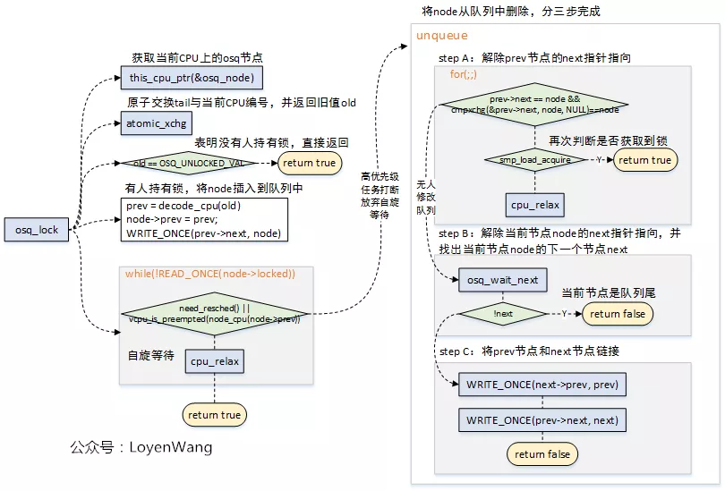
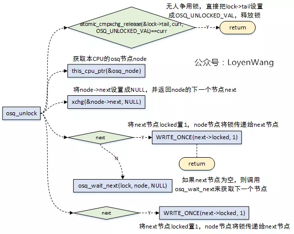
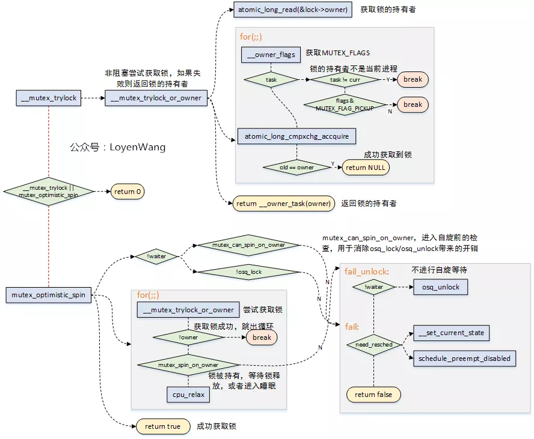

# Linux Mutex机制分析


## hardware说明：

1. Kernel版本：4.14
2. ARM64处理器，Contex-A53，双核

## 1. 概述
Mutex互斥锁是Linux内核中用于互斥操作的一种同步原语；

* 互斥锁是一种休眠锁，锁争用时可能存在进程的睡眠与唤醒，context的切换带来的代价较高，适用于加锁时间较长的场景；
* 互斥锁每次只允许一个进程进入临界区，有点类似于二值信号量；
* 互斥锁在锁争用时，在锁被持有时，选择自选等待，而不立即进行休眠，可以极大的提高性能，这种机制（optimistic spinning）也应用到了读写信号量上；
* 互斥锁的缺点是互斥锁对象的结构较大，会占用更多的CPU缓存和内存空间；
* 与信号量相比，互斥锁的性能与扩展性都更好，因此，在内核中总是会优先考虑互斥锁；
* 互斥锁按为了提高性能，提供了三条路径处理：快速路径，中速路径，慢速路径；

前戏都已经讲完了，来看看实际的实现过程吧。

## 2. optimistic spinning
### 2.1 MCS锁
1. 上文中提到过Mutex在实现过程中，采用了optimistic spinning自旋等待机制，这个机制的核心就是基于MCS锁机制来实现的；
1. MCS锁机制是由John Mellor Crummey和Michael Scott在论文中《algorithms for scalable synchronization on shared-memory multiprocessors》提出的，并以他俩的名字来命名；
1. MCS锁机制要解决的问题是：在多CPU系统中，自旋锁都在同一个变量上进行自旋，在获取锁时会将包含锁的cache line移动到本地CPU，这种cache-line bouncing会很大程度影响性能；
1. MCS锁机制的核心思想：每个CPU都分配一个自旋锁结构体，自旋锁的申请者（per-CPU）在local-CPU变量上自旋，这些结构体组建成一个链表，申请者自旋等待前驱节点释放该锁；
1. osq(optimistci spinning queue)是基于MCS算法的一个具体实现，并经过了迭代优化；


### 2.2 osq流程分析
optimistic spinning，乐观自旋，到底有多乐观呢？当发现锁被持有时，optimistic spinning相信持有者很快就能把锁释放，因此它选择自旋等待，而不是睡眠等待，这样也就能减少进程切换带来的开销了。

看一下数据结构吧：


osq_lock如下：



osq加锁有几种情况：

1. 无人持有锁，那是最理想的状态，直接返回；
1. 有人持有锁，将当前的Node加入到OSQ队列中，在没有高优先级任务抢占时，自旋等待前驱节点释放锁；
1. 自旋等待过程中，如果遇到高优先级任务抢占，那么需要做的事情就是将之前加入到OSQ队列中的当前节点，从OSQ队列中移除，移除的过程又分为三个步骤，分别是处理prev前驱节点的next指针指向、当前节点Node的next指针指向、以及将prev节点与next后继节点连接；

加锁过程中使用了原子操作，来确保正确性；

osq_unlock如下：




解锁时也分为几种情况：

1. 无人争用该锁，那直接可以释放锁；
1. 获取当前节点指向的下一个节点，如果下一个节点不为NULL，则将下一个节点解锁；
1. 当前节点的下一个节点为NULL，则调用osq_wait_next，来等待获取下一个节点，并在获取成功后对下一个节点进行解锁；

从解锁的情况可以看出，这个过程相当于锁的传递，从上一个节点传递给下一个节点；

在加锁和解锁的过程中，由于可能存在操作来更改osq队列，因此都调用了osq_wait_next来获取下一个确定的节点：


## 3. mutex
### 3.1 数据结构

终于来到了主题了，先看一下数据结构：
```
struct mutex {
    atomic_long_t        owner;           //原子计数，用于指向锁持有者的task struct结构
    spinlock_t        wait_lock;              //自旋锁，用于wait_list链表的保护操作
#ifdef CONFIG_MUTEX_SPIN_ON_OWNER
    struct optimistic_spin_queue osq; /* Spinner MCS lock */        //osq锁
#endif
    struct list_head    wait_list;          //链表，用于管理所有在该互斥锁上睡眠的进程
#ifdef CONFIG_DEBUG_MUTEXES
    void            *magic;
#endif
#ifdef CONFIG_DEBUG_LOCK_ALLOC
    struct lockdep_map    dep_map;
#endif
};

```


在使用mutex时，有以下几点需要注意的：

* 一次只能有一个进程能持有互斥锁；
* 只有锁的持有者能进行解锁操作；
* 禁止多次解锁操作；
* 禁止递归加锁操作；
* mutex结构只能通过API进行初始化；
* mutex结构禁止通过memset或者拷贝来进行初始化；
* 已经被持有的mutex锁禁止被再次初始化；
* mutex不允许在硬件或软件上下文（tasklets, timer）中使用；

### 3.2 加锁流程分析
 从mutex_lock加锁来看一下大概的流程：


mutex_lock为了提高性能，分为三种路径处理，优先使用快速和中速路径来处理，如果条件不满足则会跳转到慢速路径来处理，慢速路径中会进行睡眠和调度，因此开销也是最大的。

#### 3.2.1 fast-path
* 快速路径是在__mutex_trylock_fast中实现的，该函数的实现也很简单，直接调用atomic_long_cmpxchg_release(&lock->owner, 0UL, curr)函数来进行判断，如果lock->owner == 0表明锁未被持有，将curr赋值给lock->owner标识curr进程持有该锁，并直接返回；
* lock->owner不等于0，表明锁被持有，需要进入下一个路径来处理了；

#### 3.2.2 mid-path

* 中速路径和慢速路径的处理都是在__mutex_lock_common中实现的；
* __mutex_lock_common的传入参数为(lock, TASK_INTERRUPTIBLE, 0, NULL, _RET_IP_, false)，该函数中很多路径覆盖不到，接下来的分析也会剔除掉无效代码；

    中速路径的核心代码如下：



* 当发现mutex锁的持有者正在运行（另一个CPU）时，可以不进行睡眠调度，而可以选择自选等待，当锁持有者正在运行时，它很有可能很快会释放锁，这个就是乐观自旋的原因；
* 自旋等待的条件是持有锁者正在临界区运行，自旋等待才有价值；
* __mutex_trylock_or_owner函数用于尝试获取锁，如果获取失败则返回锁的持有者。互斥锁的结构体中owner字段，分为两个部分：1）锁持有者进程的task_struct（由于L1_CACHE_BYTES对齐，低位比特没有使用）；2）MUTEX_FLAGS部分，也就是对应低三位，如下：

    1. MUTEX_FLAG_WAITERS：比特0，标识存在非空等待者链表，在解锁的时候需要执行唤醒操作；
    1. MUTEX_FLAG_HANDOFF：比特1，表明解锁的时候需要将锁传递给顶部的等待者；
    1. MUTEX_FLAG_PICKUP：比特2，表明锁的交接准备已经做完了，可以等待被取走了；

* mutex_optimistic_spin用于执行乐观自旋，理想的情况下锁持有者执行完释放，当前进程就能很快的获取到锁。实际需要考虑，如果锁的持有者如果在临界区被调度出去了，task_struct->on_cpu == 0，那么需要结束自旋等待了，否则岂不是傻傻等待了。

    1. mutex_can_spin_on_owner：进入自旋前检查一下，如果当前进程需要调度，或者锁的持有者已经被调度出去了，那么直接就返回了，不需要做接下来的osq_lock/oqs_unlock工作了，节省一些额外的overhead；
    1. osq_lock用于确保只有一个等待者参与进来自旋，防止大量的等待者蜂拥而至来获取互斥锁；
    1. for(;;)自旋过程中调用__mutex_trylock_or_owner来尝试获取锁，获取到后皆大欢喜，直接返回即可；
    1. mutex_spin_on_owner，判断不满足自旋等待的条件，那么返回，让我们进入慢速路径吧，毕竟不能强求；

#### 3.2.3 slow-path

慢速路径的主要代码流程如下：


从for(;;)部分的流程可以看到，当没有获取到锁时，会调用schedule_preempt_disabled将本身的任务进行切换出去，睡眠等待，这也是它慢的原因了；

### 3.3 释放锁流程分析


* 释放锁的流程相对来说比较简单，也分为快速路径与慢速路径，快速路径只有在调试的时候打开；
* 慢速路径释放锁，针对三种不同的MUTEX_FLAG来进行判断处理，并最终唤醒等待在该锁上的任务；


## 参考
Generic Mutex Subsystem

MCS locks and qspinlocks

ref:https://mp.weixin.qq.com/s?__biz=MzI3NzA5MzUxNA==&mid=2664610248&idx=1&sn=360b3aacd112a6db8005672d5e001788&chksm=f04d942dc73a1d3b39fbeb58c6c0cb5287f339b2f10c780dac0c30e7919564b51311af343991&scene=132#wechat_redirect


