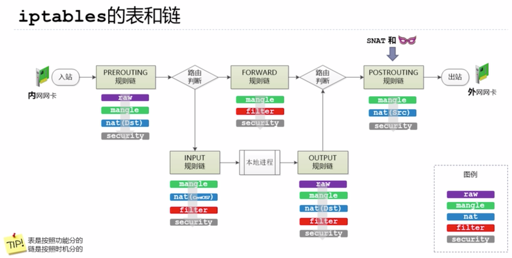

#

## 1. 表与链

* 表是按功能划分
* 链是按时机划分

默认表是filter（没有指定表的时候就是filter表）。
表的处理优先级：raw>mangle>nat>filter。


### 1.1 表

+ filter  
包含了三个内置链：INPUT，FORWARD，OUTPUT。 用于一般的过滤功能

+ nat  
用于nat功能（端口映射，地址映射等）
当一个数据包创建一个新的连接时使用。它由四个内置：
PREROUTING，INPUT，OUTPUT，POSTROUTING 。

+ mangle  
从内核 2.4.18 开始，支持全部的5个链，用于对特定数据包的修改

+ raw  
优先级最高，设置raw时一般是为了不再让iptables做数据包的链接跟踪处理，提高性。

+ security  

### 1.2 链

1. PREROUTING（用于数据包到来时更改他们），
1. INPUT（用于改变数据包的目的地对于本地套接字），
1. FORWARDING:通过路由表后，目的地不为本机
1. OUTPUT（用于在路由前更改本地生成的数据包）和
1. POSTROUTING （用于在数据包即将发出时更改数据包）。


## 2. usage
选项

### 2.1 -t 
指定表，无-t时候，显示filter表

### 2.2 -L --list
列出表中的规则

### 2.3 

-A  --append 添加规则

-D  --delete 删除规则

* use iptables filter ping packet from other host
```bash
sudo iptables -A INPUT -p icmp --icmp-type echo-request -j DROP
sudo iptables -L INPUT --line-numbers
sudo iptables -D INPUT <rule line> 
```
