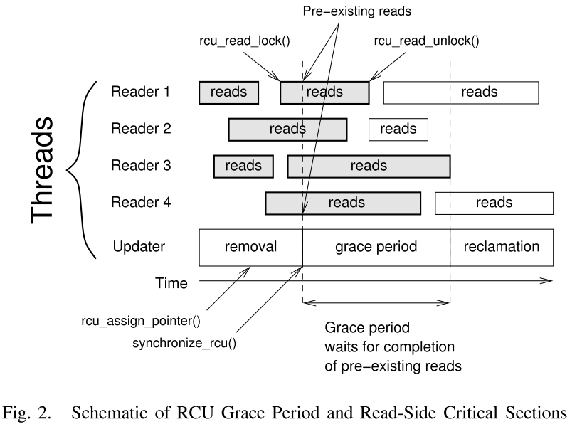
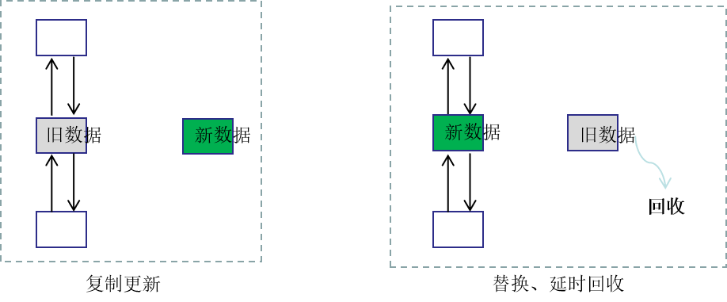

#

!!! note "note"
    Lorem ipsum dolor sit amet, consectetur adipiscing elit. Nulla et euismod
    nulla. Curabitur feugiat, tortor non consequat finibus, justo purus auctor
    massa, nec semper lorem quam in massa.

==hello world==


## RCU 机制简介
什么是RCU？是Read，Copy-Update的缩写，意指读-复制更新。是一种同步机制。其将同步开销的非对称分布发挥到逻辑极限，

## RCU 基本概念
**读侧临界区 (read-side critical sections)**: RCU读者执行的区域，每一个临界区开始于rcu_read_lock()，结束于rcu_read_unlock()，可能包含rcu_dereference()等访问RCU保护的数据结构的函数。这些指针函数实现了依赖顺序加载的概念，称为memory_order_consume加载。

**写侧临界区**：为适应读侧临界区，写侧推迟销毁并维护多个版本的数据结构，有大量的同步开销。此外，编写者必须使用某种同步机制（例如锁定）来提供有序的更新。

**静默态(quiescent state)**: 当一个线程没有运行在读侧临界区时，其就处在静默状态。持续相当长一段时间的静默状态称之为延长的静默态（extended quiescent state）。

**宽限期（Grace period)**: 宽限期是指所有线程都至少A一次进入静默态的时间。宽限期前所有在读侧临界区的读者在宽限区后都会结束。不同的宽限期可能有部分或全部重叠。

读者在读临界区遍历RCU数据。如果写者从此数据中移除一个元素，需要等待一个宽限期后才能执行回收内存操作。上述操作的示意图如下图所示，其中，标有read的框框为一个读临界区。



上图中，每一个读者、更新者表示一个独立的线程，总共4个读线程，一个写线程。<br>
RCU更新操作分为两个阶段：**移除阶段和回收阶段**。两个阶段通过宽限期隔开。更新者在移除元素后，通过synchronize_rcu()原语，初始化一个宽限期，并等待宽限期结束后，回收移除的元素。

1. 移除阶段：RCU更新通过rcu_assign_pointer()等函数移除或插入元素。现代CPU的指针操作都是原子的，
rcu_assign_pointer()原语在大多数系统上编译为一个简单的指针赋值操作。移除的元素仅可被移除阶段（以灰色显示）前的读者访问。
2. 回收阶段：一个宽限期后， 宽限期开始前的原有读者都完成读操作，因此，此阶段可安全释放由删除阶段删除的元素。

一个宽限期可以用于多个删除阶段，即可由多个更新程序执行更新。
此外，跟踪RCU宽限期的开销可能会均摊到现有流程调度上，因此开销较小。对于某些常见的工作负载，宽限期跟踪开销可以被多个RCU更新操作均摊，从而使每个RCU更新的平均开销接近零。

临界区指的是一个访问共用资源（例如：共用设备或是共用存储器）的程序片段，而这些共用资源又无法同时被多个线程访问的特性。当有线程进入临界区段时，其他线程或是进程必须等待（例如：bounded waiting 等待法），有一些同步的机制必须在临界区段的进入点与离开点实现，以确保这些共用资源是被互斥获得使用，例如：semaphore。只能被单一线程访问的设备，例如：打印机。

读者提供一个信号告诉写者什么时候可以安全执行销毁操作，但是这个信号可能是被延时的，允许多个读侧临界区使用一个信号。RCU通常通过一个非原子地增加本地计数器告诉写者，这种操作开销非常小。另外，RCU中没有指定写者是否并行。

RCU 的关键思想有两个：1）复制后更新；2）延迟回收内存。典型的RCU更新时序如下:

*    **复制**：将需要更新的数据复制到新内存地址；
*    **更新**：更新复制数据，这时候操作的新的内存地址；
*    **替换**：使用新内存地址指针替换旧数据内存地址指针，此后旧数据将无法被后续读者访问；
*    **等待**，所有访问旧数据的读者进入静默期，即访问旧数据完成；
*    **回收**：当没有任何持有旧数据结构引用的读者后，安全地回收旧数据内存。

可见，RCU 首先将需要修改的内容复制出一份副本，然后在副本上进行修改操作。在写者进行修改操作的过程中，旧数据没有做任何更新，不会产生读写竞争，因此依然可以被读者并行访问。当写者修改完成后，写者直接将新数据内存地址替换掉旧数据的内存地址，由于内存地址替换操作是原子的，因此可以保证读写不会产生冲突。内存地址替换后，原有读者访问旧数据，新的读者将访问新数据。当原有读者访问完旧数据，进入静默期后，旧数据将被写者删除回收。当然，通常写者只进行更新、删除指针操作，旧数据内存的回收由另一个线程完成。

下面，以双向链表为例，说明使用 RCU 更新链表中的数据的过程，如下图所示：

*    **复制更新**：复制旧数据到新数据，并在新数据进行修改操作；
*    **替换，延时回收**：将新数据替换掉链表中的旧数据，当无读者访问旧数据时，就行内存回收。



使用RCU注意如下事项：

* RCU适用多读少写场景。RCU和读写锁相似.但RCU的读者占锁没有任何的系统开销。写者与写者之间必须要保持同步,且写者必须要等它之前的读者全部都退出之后才能释放之前的资源。
* RCU保护的是指针.这一点尤其重要.因为指针赋值是一条单指令.也就是说是一个原子操作.因它更改指针指向没必要考虑它的同步.只需要考虑cache的影响；
* 读者是嵌套。也就是说rcu_read_lock()可以嵌套调用；
* 读者在持有rcu_read_lock()的时候,不能发生进程上下文切换.否则,因为写者需要要等待读者完成,写者进程也会一直被阻塞.
* 因为在非抢占场景中上下文切换不能发生在RCU的读侧临界区，所以已阻塞的任何线程必须在RCU读侧临界区之前完成。
* 任何没有跑在RCU读侧临界区的线程不能持有任何RCU受保护的引用
* 阻塞的线程不能持有受保护的RCU数据结构
* 线程不能引用已经删除的的受保护的RCU数据结构
* 阻塞的线程在受保护的RCU指针被移除后，不能再引用
* 从RCU保护的数据结构中删除给定元素后，一旦观察到所有线程处于阻塞状态，则RCU读侧临界区中的任何线程都无法持有该元素的引用


## 核心API

核心的RCU API非常的少，如下：
```c
rcu_read_lock()
rcu_read_unlock()
synchronize_rcu()/call_rcu()
rcu_assign_pointer()
rcu_dereference()
```
RCU API还有许多其他成员，但是其余的可以用这五种来表示。

## rcu_read_lock()
void rcu_read_lock(void);
读者读取受RCU保护的数据结构时使用，通知回收者读者进入了RCU的读端临界区。在RCU读端临界区访问的任何受RCU保护的数据结构都会保证在临界区期间保持未回收状态。另外，引用计数可以与RCU一起使用，以维护对数据结构的长期引用。在RCU读侧临界区阻塞是非法的。在Linux普通的TREE RCU实现中，rcu_read_lock的实现非常简单，是关闭抢占：

static inline void __rcu_read_lock(void)
{
    preempt_disable();
}
## rcu_read_unlock()
void rcu_read_unlock(void);
读者结束读取后使用，用于通知回收者其退出了读端临界区。RCU的读端临界区可能被嵌套或重叠。Linux普通的TREE RCU实现中，rcu_read_unlock 的实现是开发抢占。

static inline void __rcu_read_unlock(void)
{
    preempt_enable();
}

## synchronize_rcu()
void synchronize_rcu(void);
synchronize_rcu 函数的关键思想是等待。确保读者完成对旧结构体的操作后释放旧结构体。synchronize_rcu 的调用点标志着“更新者代码的结束”和“回收者代码的开始”。它通过阻塞来做到这一点，直到所有cpu上所有预先存在的RCU读端临界区都完成。

需要注意的是，synchronize_rcu()只需要等待调用它之前的读端临界区完成，不需要等待调用它之后开始的读取者完成。另外，synchronize_rcu()不一定在最后一个预先存在的RCU读端临界区完成之后立即返回。具体实现中可能会有延时调度。同时，为了提高效率，许多RCU实现请求批量处理，这可能会进一步延迟 synchronize_rcu() 的返回。

## call_rcu()

call_rcu() API是syncnize_rcu()的回调形式，它注册而不是阻塞，而是注册一个函数和自变量，这些函数和自变量在所有正在进行的RCU读取侧关键部分均已完成之后被调用。 在禁止非法访问或更新端性能要求比较高时，此回调变体特别有用。

但是，不应轻易使用call_rcu() API，因为对syncnize_rcu() API的使用通常会使代码更简单。
此外，synchronize_rcu() API具有不错的属性，可以在宽限期被延迟时自动限制更新速率。
面对拒绝服务攻击，此属性导致系统具有弹性。 使用call_rcu（）的代码应限制更新速率，以获得相同的弹性。 有关限制更新速率的一些方法，请参见checklist.txt。

在上面的例子中，foo_update_a（）阻塞直到一个宽限期结束。这很简单，但在某些情况下，人们不能等这么久——可能还有其他高优先级的工作要做。
在这种情况下，使用call_rcu()而不是synchronize_rcu()。call_rcu() API如下：

void call_rcu(struct rcu_head * head, void (*func)(struct rcu_head *head));
此函数在宽限期过后调用func(heda)。此调用可能发生在softirq或进程上下文中，因此不允许阻止该函数。foo结构需要添加一个rcu-head结构，可能如下所示：
```
struct foo {
    int a;
    char b; 
    long c;
    struct rcu_head rcu; 
 };
```
foo_update_a()函数示例如下：
```
/*
* Create a new struct foo that is the same as the one currently
* * pointed to by gbl_foo, except that field "a" is replaced 
* * with "new_a". Points gbl_foo to the new structure, and 
* * frees up the old structure after a grace period. *
* Uses rcu_assign_pointer() to ensure that concurrent readers 
* * see the initialized version of the new structure.
* * Uses call_rcu() to ensure that any readers that might have
* * references to the old structure complete before freeing the * old structure.
* */
void foo_update_a(int new_a) {
    struct foo *new_fp; 
    struct foo *old_fp;
    new_fp = kmalloc(sizeof(*new_fp), GFP_KERNEL); 
    spin_lock(&foo_mutex);
    old_fp = rcu_dereference_protected(gbl_foo, lockdep_is_held(&foo_mutex)); 
    *new_fp = *old_fp; 
    new_fp->a = new_a;
    rcu_assign_pointer(gbl_foo, new_fp); 
    spin_unlock(&foo_mutex);
    call_rcu(&old_fp->rcu, foo_reclaim); 
} 

// The foo_reclaim() function might appear as follows:
void foo_reclaim(struct rcu_head *rp) {
    struct foo *fp = container_of(rp, struct foo, rcu); 
    foo_cleanup(fp->a); 
    kfree(fp);
}
```

container_of() 原语是一个宏，给定指向结构的指针，结构的类型以及结构内的指向字段，该宏将返回指向结构开头的指针。

使用 call_rcu() 可使 foo_update_a() 的调用方立即重新获得控制权，而不必担心新近更新的元素的旧版本。 它还清楚地显示了更新程序 foo_update_a()和回收程序 foo_reclai() 之间的RCU区别。

总结：

在从受RCU保护的数据结构中删除数据元素之后，请使用call_rcu()-以注册一个回调函数，该函数将在所有可能引用该数据项的RCU读取侧完成后调用。
如果call_rcu()的回调除了在结构上调用kfree()之外没有做其他事情，则可以使用kfree_rcu()代替call_rcu()来避免编写自己的回调：kfree_rcu（old_fp，rcu）

## rcu_assign_pointer()
原型： void rcu_assign_pointer(p, typeof(p) v);

rcu_assign_pointer()通过宏实现。将新指针赋给RCU结构体，赋值前的读者看到的还是旧的指针。

更新者使用这个函数为受rcu保护的指针分配一个新值，以便安全地将更新的值更改传递给读者。
此宏不计算rvalue，但它执行某CPU体系结构所需的内存屏障指令。保证内存屏障前的指令一定会先于内存屏障后的指令被执行。

它用于记录（1）哪些指针受RCU保护以及（2）给定结构可供其他CPU访问的点。
rcu_assign_pointer()最常通过_rcu列表操作原语（例如list_add_rcu()）间接使用。

## rcu_dereference()
原型： typeof(p) rcu_dereference(p);

与rcu_assign_pointer()类似，rcu_dereference()也必须通过宏实现。

读者通过rcu_dereference()获取受保护的RCU指针，该指针返回一个可以安全解除引用的值。
请注意，rcu_dereference()实际上并未取消对指针的引用，相反，它保护指针供以后取消引用。
它还针对给定的CPU体系结构执行任何所需的内存屏障指令。 当前，只有Alpha CPU架构才需要rcu_dereference()中的内存屏障-在其他CPU上，它编译为无内容，甚至编译器指令也没有。

常见的编码实践是使用rcu_dereference() 将一个受rcu保护的指针复制到一个局部变量，然后解引用这个局部变量，例如:

    p = rcu_dereference(head.next);
    return p->data;
然而，上述情况可以整合成如下一句：

    return rcu_dereference(head.next)->data;
如果您要从受rcu保护的结构中获取多个字段，那么使用局部变量当然是首选的。重复的rcu_dereference()调用看起来很糟糕，不能保证在关键部分发生更新时返回相同的指针，并且会在Alpha cpu上产生不必要的开销。

注意，rcu_dereference()返回的值仅在封闭的RCU读端临界区[1]内有效。

!!! note "以下内容是不合法的"

```c hl_lines="2 4"
    rcu_read_lock();
    p = rcu_dereference(head.next);
    rcu_read_unlock();

    x = p->address;  /* BUG!!! */
    rcu_read_lock();
    y = p->data;     /* BUG!!! */
    rcu_read_unlock();
```
将一个RCU读临界区获得的引用保留到另一个是非法的；同事，将一个锁定的临界区的引用放在另一个中使用也是非法的。

与rcu_assign_pointer(）一样，rcu_dereference()的重要功能是记录哪些指针受RCU保护，尤其是标记一个随时可能更改的指针，包括紧随rcu_dereference()之后。
通常通过_rcu列表操作基元（例如list_for_each_entry_rcu()）间接使用rcu_dereference()。

变量rcu_dereference_protected()可以在RCU读取临界区外使用，只要使用情况受到更新者代码获取的锁的保护即可。

下图展示了不同角色之间的通信。

        rcu_assign_pointer()
                                +--------+
        +---------------------->| 读者   |---------+
        |                       +--------+         |
        |                           |              |
        |                           |              | Protect:
        |                           |              | rcu_read_lock()
        |                           |              | rcu_read_unlock()
        |        rcu_dereference()  |              |
        +---------+                 |              |
        | 更新者  |<----------------+              |
        +---------+                                V
        |                                    +-----------+
        +----------------------------------->| 回收者    |
                                             +-----------+
          推迟、等待:
          synchronize_rcu() & call_rcu()
RCU基础结构会观察rcu_read_lock()，rcu_read_unlock()，synchronize_rcu() 和call_rcu() 调用的时间顺序，以确定何时（1）syncnize_rcu()调用何时可以返回，以及（2）call_rcu() 回调可以被调用。
RCU基础结构的有效实现大量使用批处理，以便在相应API的许多使用上分摊其开销。

在Linux内核中至少有三种RCU用法。上图显示了最常见的一种。在更新端，rcu_assign_pointer()、sychronize_rcu()和call_rcu()这三种基本类型使用的原语是相同的。但是为了保护(在读端)，使用的原语根据不同的口味而有所不同:

```
a.
rcu_read_lock() / rcu_read_unlock() 
rcu_dereference()

b.
rcu_read_lock_bh() / rcu_read_unlock_bh() 
local_bh_disable() / local_bh_enable() 
rcu_dereference_bh()

c.
rcu_read_lock_sched() / rcu_read_unlock_sched() 
preempt_disable() / preempt_enable() 
local_irq_save() / local_irq_restore()
hardirq enter / hardirq exit 
NMI enter / NMI exit 
rcu_dereference_sched()

```

上述三种类型的使用方法如下：

    a. RCU应用于普通的数据结构。
    b. RCU应用于可能遭受远程拒绝服务攻击的网络数据结构。
    c. RCU应用于调度器和中断/ nmi处理器任务。

同样，大多数用途是（a）（b）和（c）情况对于专门用途很重要，但相对较少见。

## 核心API使用示例

本节展示如何简单使用核心RCU API来保护指向动态分配结构的全局指针。
更多的典型用法在 listRCU.txt , arrayRCU.txt , NMI-RCU.txt中被使用。

```
struct foo {
    int a;
    char b;
    long c;
};

DEFINE_SPINLOCK(foo_mutex); // 定义spin锁

struct foo __rcu *gbl_foo;  // 声明一个受保护的指针

/*
 * Create a new struct foo that is the same as the one currently 
 * pointed to by gbl_foo, except that field "a" is replaced 
 * with "new_a". Points gbl_foo to the new structure, and 
 * frees up the old structure after a grace period. 
 * 
 * Uses rcu_assign_pointer() to ensure that concurrent readers 
 * see the initialized version of the new structure. 
 * 
 * Uses synchronize_rcu() to ensure that any readers that might
 * have references to the old structure complete before freeing 
 * the old structure. 
 */
void foo_update_a(int new_a) 
{
    struct foo *new_fp; 
    struct foo *old_fp;
    new_fp = kmalloc(sizeof(*new_fp), GFP_KERNEL);
    spin_lock(&foo_mutex);  // 更新操作上锁
    old_fp = rcu_dereference_protected(gbl_foo, lockdep_is_held(&foo_mutex)); 
    *new_fp = *old_fp; 
    new_fp->a = new_a;
    rcu_assign_pointer(gbl_foo, new_fp);  // 确保并行的读者看到新结构的旧版本
    spin_unlock(&foo_mutex); 
    synchronize_rcu();  // 确保所有引用旧的数据结构的读者都退出了临界区
    kfree(old_fp);
} 

/*
 * Return the value of field "a" of the current gbl_foo 
 * structure. Use rcu_read_lock() and rcu_read_unlock() 
 * to ensure that the structure does not get deleted out 
 * from under us, and use rcu_dereference() to ensure that 
 * we see the initialized version of the structure (important 
 * for DEC Alpha and for people reading the code).
 */
int foo_get_a(void) {
    int retval; 
    rcu_read_lock();
    retval = rcu_dereference(gbl_foo)->a; 
    rcu_read_unlock(); 
    return retval;
}

```
总结如下：

使用 rcu_read_lock() 与 rcu_read_unlock() 保证其处于读端临界区；
在读端临界区内，使用 rcu_dereference() 解引用受RCU保护的指针
使用一些可靠的方案保证并行更新操作不会互相干扰，如锁或者向量
使用rcu_assign_pointer()更新受rcu保护的指针。这个原语保护并发读不受更新操作(而不是并发更新)的影响！但是，仍然需要使用锁(或类似的东西)来防止并发rcu_assign_pointer()原语相互干扰。
使用synchronize_rcu() 在从受RCU保护的数据结构中删除一个数据元素之后，但是在回收/释放数据元素之前，为了等待所有可能正在引用那个数据项的RCU读端临界区完成。

## FAQs

rcu_dereference() vs rcu_dereference_protected()？
简而言之:

rcu_dereference()应该在阅读方使用,受rcu_read_lock()保护。
rcu_dereference_protected()应该由单个写者在在写入侧(更新侧)使用,或者由锁定保护,这会阻止多个写入器同时修改解除引用的指针.在这种情况下,指针不能在当前线程之外进行修改,因此既不需要编译器也不需要cpu-barrier.
使用rcu_dereference总是安全的,并且其性能损失(与之相比rcu_dereference_protected)很低.

精确描述了rcu_dereference_protected在内核4.6:

```C
/**
 * rcu_dereference_protected() - fetch RCU pointer when updates prevented
 * @p: The pointer to read, prior to dereferencing
 * @c: The conditions under which the dereference will take place
 *
 * Return the value of the specified RCU-protected pointer, but omit
 * both the smp_read_barrier_depends() and the READ_ONCE().  This
 * is useful in cases where update-side locks prevent the value of the
 * pointer from changing.  Please note that this primitive does -not-
 * prevent the compiler from repeating this reference or combining it
 * with other references, so it should not be used without protection
 * of appropriate locks.
 *
 * This function is only for update-side use.  Using this function
 * when protected only by rcu_read_lock() will result in infrequent
 * but very ugly failures.
 */
```

## 参考
* [what is RCU](https://www.kernel.org/doc/Documentation/RCU/whatisRCU.rst)
* [What is RCU? Part 2: Usage](https://lwn.net/Articles/263130/)
* [RCU synchronize原理分析](http://www.wowotech.net/kernel_synchronization/223.html)
* [LINUX内核之内存屏障](https://www.cnblogs.com/icanth/archive/2012/06/10/2544300.html)
* [一文让你明白CPU上下文切换](https://zhuanlan.zhihu.com/p/52845869)
* [src rcu 机制简介](https://zhuanlan.zhihu.com/p/113999842)


