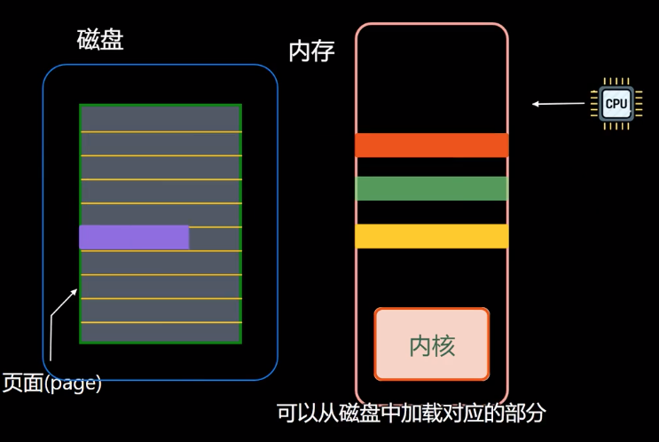

## 虚拟内存：

术语：
### DRAM
DRAM缓存来表示虚拟内存系统中的缓存,它在主存中缓存虚拟页。


### MMU(Memory Management Unit)
CPU芯片上的内存管理单元利用内存中的查询表来翻译虚拟地址，表内容由操作系统管理。

### 快表TBL（Translation Lookaside Buffer)
是MMU中关于PTE的小缓存示虚拟内存系统的缓存，它在主存中缓存虚拟页。
### 页表
页表：存放在内存中的页表条目数组，将虚拟页映射到物理页；
虚拟地址空间中的每个页在页表中一个偏移量处都有一个PTE（Page Table Entry），   

假定PTE由 **有效位** 和 **地址字段** 组成。

|有效位 | 地址字段| 含义| 
|--|--|--
1 | ptr=0x111 | ptr表示DRAM中对应物理页的首地址
0 | ptr=0x111 | ptr表示该页在磁盘上的首地址
0 | ptr=NULL | ptr表示该页未分配


### 页命中

CPU 访问虚拟地址时候，地址翻译硬件将虚拟地址作为索引定位到PTE，当时PTE设置了有效位时候，
说明虚拟页缓存在内存中了，PTE中的地址字段就是内存中该页的首地址。

### 缺页

DRAM不命中成为缺页(page fault)。

### 多级页表

以32位系统为例，页大小为4kb，PTE为4字节。需要4M的页表留在内存中。其中只使用来虚拟地址空间的一小部分。

####  多级页表两方面减少内存使用

1. 如果一个一级页表的PTE是空的，那么二级页表就不会存在
2. 只有一级页表才需要驻留在内存中，只有经常使用的二级页表才会缓存在主存中。


## 死锁
### 死锁必要条件及避免算法、

1. 资源不能共享，只能由一个进程使用。
2. 请求与保持（Hold andwait）：已经得到资源的进程可以再次申请新的资源。
3. 不可剥夺（Nopre-emption）：已经分配的资源不能从相应的进程中被强制地剥夺。
4. 循环等待：系统中若干进程组成环路，该环路中每个进程都在等待相邻进程正占用的资源

### 处理死锁的策略：
通过破除死锁四个必要条件之一，来防止死锁产生。

1. 保证相同的加锁顺序避免死锁。（避免环路）
2. 检测死锁并且恢复。(破坏请求与保持)
    1. 请求资源时候检测，获取不到资源就释放已经获取的资源
    2. 定时检测是否发生死锁


## linux大小端问题

1. Little-Endian就是低位字节排放在内存的低地址端，高位字节排放在内存的高地址端。
2. Big-Endian就是高位字节排放在内存的低地址端，低位字节排放在内存的高地址端。

举一个例子，比如数字高位在左边 0x12 34 56 78在内存中的表示形式为：

1. 大端模式：高位也在左边，阅读顺序一致，高位低地址
```
低地址 -----------------> 高地址
0x12  |  0x34  |  0x56  |  0x78
```

2. 小端模式：
```
低地址 ------------------> 高地址
0x78  |  0x56  |  0x34  |  0x12
```

### 大端小端各自优势：
1. 小端模式 ：强制转换数据不需要调整字节内容，1、2、4字节的存储方式一样。
2. 大端模式 ：符号位的判定固定为第一个字节，容易判断正负。


一般操作系统都是小端，而通讯协议是大端的。

常见CPU的字节序
Big Endian : PowerPC、IBM、Sun
Little Endian : x86、DEC
ARM既可以工作在大端模式，也可以工作在小端模式。
```
BOOL GetEndian()
{
    int a = 0x1234;
    //通过将int强制类型转换成char单字节，通过判断起始存储位置。即等于 取b等于a的低地址部分
    char b =  *(char *)&a;
    if( b == 0x12)
    {
        return BigEndian;
    }
    return SmallEndian;
}
```
联合体union的存放顺序是所有成员都从低地址开始存放，利用该特性可以轻松地获得了CPU对内存采用Little-endian还是Big-endian模式读写：
```
BOOL IsBigEndian()
{
    union NUM
    {
        int a;
        char b;
    }num;
    num. a = 0x1234;
    if( num. b == 0x12 )
    {
        return TRUE;
    }
    return FALSE;
}
```

### 辨别系统是16位or32位

法一：int k=~0;  
法二：sizeof(void*) ;

## 信号

    信号机制是进程之间相互传递消息的一种方法，信号全称为软中断信号，也有人称作软中断。
    进程之间可以互相通过系统调用kill发送软中断信号。
    SIGHUP 1 A 终端挂起或者控制进程终止
    SIGINT 2 A 键盘中断（如break键被按下）
    SIGQUIT 3 C 键盘的退出键被按下
    SIGILL 4 C 非法指令
    SIGABRT 6 C 由abort(3)发出的退出指令
    SIGFPE 8 C 浮点异常
    SIGKILL 9 AEF Kill信号
    SIGSEGV 11 C 无效的内存引用
    SIGPIPE 13 A 管道破裂: 写一个没有读端口的管道

信号机制是异步的；当一个进程接收到一个信号时，它会立刻处理这个信号，而不会等待当前函数甚至当前一行代码结束运行。信号有几十种，分别代表着不同的意义。信号之间依靠它们的值来区分，但是通常在程序中使用信号的名字来表示一个信号。在Linux系统中，这些信号和以它们的名称命名的常量均定义在/usr/include/bits/signum. h文件中。（通常程序中不需要直接包含这个头文件，而应该包含<signal. h>。）

信号事件的发生有两个来源：硬件来源(比如我们按下了键盘或者其它硬件故障)；软件来源，最常用发送信号的系统函数是kill, raise, alarm和setitimer以及sigqueue函数，软件来源还包括一些非法运算等操作。

发送信号的主要函数有：kill()、raise()、 sigqueue()、alarm()、setitimer()以及abort()。


进程可以通过三种方式来响应一个信号：（1）忽略信号，即对信号不做任何处理，其中，有两个信号不能忽略：SIGKILL及SIGSTOP；（2）捕捉信号。定义信号处理函数，当信号发生时，执行相应的处理函数；（3）执行缺省操作，


## 实现守护进程的步骤

守护进程最重要的特性是后台运行。

1.  在后台运行。
    为避免挂起控制终端将Daemon放入后台执行。方法是在进程中调用fork使父进程终止，让Daemon在子进程中后台执行。

    if(pid=fork())
    exit(0); //是父进程，结束父进程，子进程继续

2.  脱离控制终端，登录会话和进程组

    有必要先介绍一下Linux中的进程与控制终端，登录会话和进程组之间的关系：进程属于一个进程组，进程组号（GID）就是进程组长的进程号（PID）。登录会话可以包含多个进程组。这些进程组共享一个控制终端。这个控制终端通常是创建进程的登录终端。控制终端，登录会话和进程组通常是从父进程继承下来的。我们的目的就是要摆脱它们，使之不受它们的影响。方法是在第1点的基础上，调用setsid()使进程成为会话组长：

    setsid();

    说明：当进程是会话组长时setsid()调用失败。但第一点已经保证进程不是会话组长。setsid()调用成功后，进程成为新的会话组长和新的进程组长，并与原来的登录会话和进程组脱离。由于会话过程对控制终端的独占性，进程同时与控制终端脱离。

3.  禁止进程重新打开控制终端

    现在，进程已经成为无终端的会话组长。但它可以重新申请打开一个控制终端。可以通过使进程不再成为会话组长来禁止进程重新打开控制终端：

    if(pid=fork()) exit(0); //结束第一子进程，第二子进程继续（第二子进程不再是会话组长）

4.  关闭打开的文件描述符

    进程从创建它的父进程那里继承了打开的文件描述符。如不关闭，将会浪费系统资源，造成进程所在的文件系统无法卸下以及引起无法预料的错误。按如下方法关闭它们：

    for(i=0;i 关闭打开的文件描述符close(i);>

5.  改变当前工作目录

    进程活动时，其工作目录所在的文件系统不能卸下。一般需要将工作目录改变到根目录。对于需要转储核心，写运行日志的进程将工作目录改变到特定目录如 /tmpchdir("/")

6.  重设文件创建掩模

    进程从创建它的父进程那里继承了文件创建掩模。它可能修改守护进程所创建的文件的存取位。为防止这一点，将文件创建掩模清除：umask(0);

7.  处理SIGCHLD信号

    处理SIGCHLD信号并不是必须的。但对于某些进程，特别是服务器进程往往在请求到来时生成子进程处理请求。如果父进程不等待子进程结束，子进程将成为僵尸进程（zombie）从而占用系统资源。如果父进程等待子进程结束，将增加父进程的负担，影响服务器进程的并发性能。在Linux下可以简单地将 SIGCHLD信号的操作设为SIG_IGN。

    signal(SIGCHLD,SIG_IGN);

    这样，内核在子进程结束时不会产生僵尸进程。这一点与BSD4不同，BSD4下必须显式等待子进程结束才能释放僵尸进程。

### 标准库函数和系统调用的区别

1. 系统调用

    系统调用提供的函数如open, close, read, write, ioctl等，需包含头文件unistd. h。以write为例：其函数原型为 size_t write(int fd, const void *buf, size_t nbytes)，其操作对象为文件描述符或文件句柄fd(file descriptor)，要想写一个文件，必须先以可写权限用open系统调用打开一个文件，获得所打开文件的fd，例如fd=open(/"/dev/video/", O_RDWR)。fd是一个整型值，每新打开一个文件，所获得的fd为当前最大fd加1。Linux系统默认分配了3个文件描述符值：0－standard input，1－standard output，2－standard error。

    系统调用通常用于底层文件访问（low-level file access），例如在驱动程序中对设备文件的直接访问。
    系统调用是操作系统相关的，因此一般没有跨操作系统的可移植性。

    系统调用发生在内核空间，因此如果在用户空间的一般应用程序中使用系统调用来进行文件操作，会有用户空间到内核空间切换的开销。事实上，即使在用户空间使用库函数来对文件进行操作，因为文件总是存在于存储介质上，因此不管是读写操作，都是对硬件（存储器）的操作，都必然会引起系统调用。也就是说，库函数对文件的操作实际上是通过系统调用来实现的。例如C库函数fwrite()就是通过write()系统调用来实现的。

    这样的话，使用库函数也有系统调用的开销，为什么不直接使用系统调用呢？这是因为，读写文件通常是大量的数据（这种大量是相对于底层驱动的系统调用所实现的数据操作单位而言），这时，使用库函数就可以大大减少系统调用的次数。这一结果又缘于缓冲区技术。在用户空间和内核空间，对文件操作都使用了缓冲区，例如用fwrite写文件，都是先将内容写到用户空间缓冲区，当用户空间缓冲区满或者写操作结束时，才将用户缓冲区的内容写到内核缓冲区，同样的道理，当内核缓冲区满或写结束时才将内核缓冲区内容写到文件对应的硬件媒介。

2. 库函数调用(可移植性好,驱动不可用)

    标准C库函数提供的文件操作函数如fopen, fread, fwrite, fclose,fflush, fseek等，需包含头文件stdio. h。以fwrite为例，其函数原型为size_t fwrite(const void *buffer,size_t size, size_t item_num, FILE *pf)，其操作对象为文件指针FILE *pf，要想写一个文件，必须先以可写权限用fopen函数打开一个文件，获得所打开文件的FILE结构指针pf，例如pf=fopen(/"~/proj/filename/",/"w/")。实际上，由于库函数对文件的操作最终是通过系统调用实现的，因此，每打开一个文件所获得的FILE结构指针都有一个内核空间的文件描述符fd与之对应。同样有相应的预定义的FILE指针：stdin－standard input，stdout－standard output，stderr－standard error。

    库函数调用通常用于应用程序中对一般文件的访问。
    库函数调用是系统无关的，因此可移植性好。
    由于库函数调用是基于C库的，因此也就不可能用于内核空间的驱动程序中对设备的操作


## PCB
32位系统一个进程最多有多少堆内存?

+ 32位系统进程地址空间是4G, 用户可访问的空间是3G 左右。
+ 一个线程的默认栈大小是`ulimit -s` 8M, 一个进程最多起300个线程。


