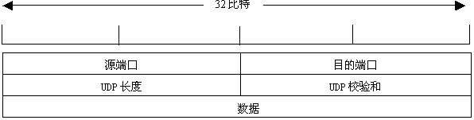
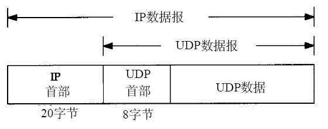

[toc]
# TCP 协议部分
## 1. TCP头部分析与确认号的理解

+ **源端口号和目的端口号**：再加上Ip首部的源IP地址和目的IP地址可以唯一确定一个TCP连接
+ **数据序号**：表示在这个报文段中的第一个数据字节序号
+ **确认序号**：仅当ACK标志为1时有效。确认号表示期望收到的下一个字节的序号（这个下面再详细分析）
+ **偏移**：就是头部长度，有4位，跟IP头部一样，以4字节为单位。最大是60个字节
+ **保留位**：6位，必须为0
+ 6个标志位：
1. URG-紧急指针有效
2. ACK-确认序号有效
3. PSH-接收方应尽快将这个报文交给应用层
4. RST-连接重置
5. SYN-同步序号用来发起一个连接
6. FIN-终止一个连接

+ **窗口字段**：16位，代表的是窗口的字节容量，也就是TCP的标准窗口最大为2^16 - 1 = 65535个字节（这个下面再详细分析）

+ **校验和**：源机器基于数据内容计算一个数值，收信息机要与源机器数值 结果完全一样，从而证明数据的有效性。检验和覆盖了整个的TCP报文段：这是一个强制性的字段，一定是由发送端计算和存储，并由接收端进行验证的。

+ **紧急指针**：是一个正偏移量，与序号字段中的值相加表示紧急数据最后一个字节的序号。TCP的紧急方式是发送端向另一端发送紧急数据的一种方式
+ **选项与填充**（必须为4字节整数倍，不够补0）：
最常见的可选字段的最长报文大小MSS（Maximum Segment Size），每个连接方通常都在一个报文段中指明这个选项。它指明本端所能接收的最大长度的报文段。
该选项如果不设置，默认为536（20+20+536=576字节的IP数据报）

## 2.TCP如何保证可靠性

* 1）应用数据被分割成TCP认为最合适发送的数据块。称为段（Segment）传递给IP层
* 2）当TCP发出一个段后，它会启动一个定时器，等待目的端确认收到这个报文段。若没有及时收到确认，将重新发送这个报文段
* 3）当TCP收到发自TCP连接另一端的数据，它将发送一个确认。这个确认不是立即发送的，通常将推迟几分之一秒。
* 4）TCP将保持它首部和数据的校验和，这是一个端到端的校验和，目的是检测数据在传输过程中的任何变化。如果收到段的校验和有差错，TCP将丢弃这个报文也不进行确认（对方就会重复发送了）。
* 5）TCP承载与IP数据报来传输，而IP数据报可能会失序，所以TCP的报文段到达时也可能会失序。但是TCP收到数据后会重新排序到正确的顺序（通过序号）。
* 6）IP数据报会发生重复，TCP的接收端必须丢弃重复是数据
* 7）TCP还能提供流量控制，TCP连接的每一方都有一定大小的缓冲空间

## 3. 滑动窗口协议（也就是对包头中窗口字段的理解）

参考1：https://www.cnblogs.com/ulihj/archive/2011/01/06/1927613.html

参考2：http://blog.chinaunix.net/uid-26275986-id-4109679.html

先上两个概念：
通告接收窗口（rwnd）：预防应用程序发送的数据超过对方的缓冲区，接收方使用的流量控制。
拥塞窗口（cwnd）：预防应用程序发送的数据超过了网络所能承载的能力。发送方使用的流量控制。
发送窗口：就是指上面两者的较小值

由于TCP的全双工的，所以其实TCP双方各自都维护一个发送窗口和接收窗口。

假设是主机A发送给主机B
A和B都会维护一个数据帧的序列，这个序列称为窗口。发送方的窗口大小由接收方确定。目的在于控制发送速度。以免接收方的缓存不够大而导致溢出，同时流量控制也可以避免网络拥塞。
这里其实是指A的发送窗口。

## 4.关于包头中确认号ack的理解

 确认序号：仅当ACK标志为1时有效。确认号表示期望收到的下一个字节的序号
这里是拿三次握手之后，开始传输数据了进行分析。
服务器向客户端发送一个数据包后，客户端收到了这个数据包，会向服务器发送一个确认数据包。

### 传输数据的简要过程如下：

1）发送数据：服务器向客户端发送一个带有数据的数据包。该数据包中的序列号和确认号与建立连接第三步的数据包找那个的序列号和确认号相同。

2）确认收到：客户端收到该数据包，向服务器发送一个确认数据包。该数据包中，序列号是为上一个数据包中的确认号值。

而确认号为服务器发送的上一个数据包中的序列号+该数据包中所带数据的大小。

回复确认收到的ack = 收到了序列号 + 数据的大小（同时也表示下一次期望收到的序号）

### nc 测试交互过程的sn、ack 变化

服务端监听本地端口3000

`nc -lv localhost 3000`

客户端连接本地端口 3000

`nc -v localhost 3000`

tcpdump 查看交互消息

`tcpdump -pnv -i lo port 3000`

## IP协议

### IP服务的特点
  IP协议是TCP/IP协议族的动力，他为上层协议提供无状态、无连接、不可靠的服务。
#### 无状态：
  是指IP通信双方不同步传输数据的状态信息，因此所有IP数据报的发送、传输和接受都是相互独立的、没有上下文关系的。
+ 缺点是无法处理乱序的和重复的IP数据报。接收端只负责将其数据部分交给上层协议，比如TCP协议，由它处理乱序的、重复的数据。
虽然IP数据报头部提供了一个标识字段用以唯一标识一个IP数据报，但它是被用来处理IP分片和重组的，而不是用来指示接收顺序的。
+ 优点是简单高效。无需为保持通信状态分配内核资源，也无需每次传输数据时都携带状态信息。
#### 无连接：
  是指IP通信双方都不长久地维持对方的任何信息。所以上层协议发送数据时，都必须明确指定对方的IP地址。
#### 不可靠：
  是指IP协议不能保证IP数据报准确地到达接受端，他只是承诺尽最大努力。就是说，发生任何意外导致IP数据报发送失败，它就通知上层协议发送失败，因此，使用IP服务的上层协议需要自己实现数据确认、超时重传等机制以达到可靠传输的目的。

### IPv4头部结构
长度通常为20字节，除非有可变长的选项部分

横着一行为32个bit，为四个字节。

+ **4位版本号** 指定IP协议的版本。对IPv4来说，为4。

+ **4位头部长度** 标识该IP头部有多少个32bit(即多少行),四位最大表示15，所以IP头部最长为60字节。

+ **8位服务类型** 包括一个三位的优先权字段(现在已忽略)四位的TOS字段和一位保留字段(保留需置0).四位的TOS字段分别表示：最小延时，最大吞吐量，最高可靠性和最小费用。这四位中最多只有一位置1。应用程序根据需要设置(比如ssh需要最小延时，ftp需要最大吞吐量)。

+ **16位总长度** 是指整个IP数据报的长度，以字节为单位，因此IP数据报最大长度为65535-1字节。但由于MTU的限制，长度超过MTU的数据报都将被分片传输，所以实际传输的IP数据报的长度都远远没有达到最大值。

+ **16位标识：** 唯一地标识主机发送的每一个数据报。其初始值由系统随机生成，每发送一个数据报，其值就加一。该值在数据报分片时被复制到每个分片中，因此同一个数据报的所有分片都具有相同的标识符。

+ **3位标志字段：** 第一位保留。第二位标识禁止分片。设置后，IP将不对该数据报分片，当该数据报长度超过MTU时，IP模块将丢弃该数据包并返回一个ICMP差错报文。第三位表示更多分片。除了数据报的最后一个分片外，其他分片都要把该位置1.

+ **13位分片偏移** 是分片相对原始IP数据报开始处(仅指数据部分)的偏移。实际的偏移值是该值左移三位(乘8)后得到的。因此，每个IP分片的数据部分的长度必须是8的整数倍。

+ **8位生存时间TTL(time to live)：** 是数据报到达目的地之前允许经过的路由器跳数。发送端设置(通常是64)。数据报每经过一次路由，该值就被路由器减一，为零时，路由器将丢弃该数据报，并向源端发送一个ICMP差错报文。TTL可以防止数据报陷入路由循环。

+ **8位协议：** 用来区分上层协议。/etc/protocols文件定义了所有上层协议对应的字段的数值。例如，ICMP是1，TCP是6，UDP是17。

+ **16位头部校验和：** 由发送端填充，接收端对其使用CRC算法检验头部在数据传输过程中是否损坏。

+ **32位源端IP地址：** 用来表示IP数据报的发送端

+ **32位目的端IP地址：** 用来表示IP数据报的接收端

+ **选项字段：** 是可变长的可选信息。最多包含40字节，可用的选项有：

记录路由：将途径的路由器的ip地址填入选项部分，用于跟踪数据报的传递路径。时间戳：告诉每个路由器将数据报被转发的时间(或时间与IP地址对)填入IP头部的选项部分，这样就可以测量途径路由之间数据报传输的时间。

松散路由选择：指定路由IP地址列表，数据包发送过程必须经过其中所有路由器。

严格路由选择：数据报只能经过被指定的路由器。

————————————————

原文链接：https://blog.csdn.net/weixin_44135544/article/details/103162399

## TCP与UDP比较

### TCP和UDP区别

key:TCP是一种面向连接的、可靠的、字节流服务
1. 面向链接：TCP面向链接，面向连接意味着两个使用TCP的应用（通常是一个客户和一个服务器）在彼此交换数据之前必须通过三次握手先建立一个TCP连接。在一个TCP中仅有两方彼此通信，多播和广播不能用于TCP。UDP是不可靠的传输，传输前不需要建立链接，可以应用多播和广播实现一对多的通信。

2. 可靠性：TCP提供端到端的流量控制，对收到的数据进行确认，采用超时重发，对失序的数据进行重新排序等机制保证数据通信的可靠性。而UDP是一种不可靠的服务，接收方可能不能收到发送方的数据报。

3. TCP是一种流模式的协议，UDP是一种数据报模式的协议。进程的每个输出操作都正好产生一个UDP数据报，并组装成一份待发送的IP数据报。TCP应用程序产生的全体数据与真正发送的单个IP数据报可能没有什么联系。TCP会有粘包和半包的现象。

4. 效率上：速度上，一般TCP速度慢，传输过程中需要对数据进行确认，超时重发，还要对数据进行排序。UDP没有这些机制所以速度快。数据比例，TCP头至少20个字节，UDP头8个字节，相对效率高。组装效率上：TCP头至少20个字节，UDP头8个字节，系统组装上TCP相对慢。

5. 用途上：用于TCP可靠性，http，ftp使用。而由于UDP速度快，视频，在线游戏多用UDP，保证实时性

对于第三点的理解。TCP可能发送100个“包”，而接收到50个“包”，不是丢“包”了，而是每次接受的“包”都比发送的多，其实TCP并没有包的概念。例如，每次发10个字节，可能读得时候一次读了20个字节。TCP是一种流模式的协议，在接收到的缓存中按照发送的包得顺序自动按照顺序拼接好，因为数据基本来自同一个主机，而且是按照顺序发送过来的，TCP的缓存中存放的就是，连续的数据。感觉好像是多封装了一步比UDP。而UDP因为可能两个不同的主机，给同一个主机发送，（一个端口可能收到多个应用程序的数据），或者按照TCP那样合并数据，必然会造成数据错误。我觉得关键的原因还是，TCP是面向连接，而UDP是无连接的，这就导致，TCP接收的数据为一个主机发来且有序无误的，而UDP可能是多个主机发来的无序，可能错误的。

### UDP头部字节定义，
+ udp 8字节

### TCP和UDP三次握手和四次挥手状态及消息类型,
待补充

### time_wait，close_wait状态产生原因，keepalive，

+ `TIME_WAIT：表示收到了对方的FIN报文，并发送出了ACK报文。 

TIME_WAIT状态下的TCP连接会等待2*MSL（Max Segment Lifetime，最大分段生存期，指一个TCP报文在Internet上的最长生存时间。每个具体的TCP协议实现都必须选择一个确定的MSL值，RFC 1122建议是2分钟，但BSD传统实现采用了30秒，Linux可以cat /proc/sys/net/ipv4/tcp_fin_timeout看到本机的这个值），然后即可回到CLOSED 可用状态了。如果FIN_WAIT_1状态下，收到了对方同时带FIN标志和ACK标志的报文时，可以直接进入到TIME_WAIT状态，而无须经过FIN_WAIT_2状态。

如果使用了nginx代理，那么系统TIME_WAIT的数量会变得比较多，这是由于nginx代理使用了短链接的方式和后端交互的原因，使得nginx和后端的ESTABLISHED变得很少而TIME_WAIT很多。这不但发生在安装nginx的代理服务器上，而且也会使后端的app服务器上有大量的TIME_WAIT。查阅TIME_WAIT资料，发现这个状态很多也没什么大问题，但可能因为它占用了系统过多的端口，导致后续的请求无法获取端口而造成障碍。

虽然TIME_WAIT会造成一些问题，但是要完全枪毙掉它也是不正当的，虽然看起来这么做没什么错。 所以目前看来最好的办法是让每个TIME_WAIT早点过期。

#### 让每个TIME_WAIT早点过期,在linux上可以这么配置：

+ 让 **TIME_WAIT** 尽快回收，我也不知是多久，观察大概是一秒钟
    `echo "1" > /proc/sys/net/ipv4/tcp_tw_recycle`
+ 让TIME_WAIT状态可以重用，这样即使TIME_WAIT占满了所有端口，也不会拒绝新的请求造成障碍
    `echo "1" > /proc/sys/net/ipv4/tcp_tw_reuse`

很多文档都会建议两个参数都配置上，但是我发现只用修改tcp_tw_recycle就可以解决问题的了，TIME_WAIT重用TCP协议本身就是不建议打开的。

不能重用端口可能会造成系统的某些服务无法启动，比如要重启一个系统监控的软件，它用了40000端口，而这个端口在软件重启过程中刚好被使用了，就可能会重启失败的。linux默认考虑到了这个问题，有这么个设定：

+ 查看系统本地可用端口极限值
    `cat /proc/sys/net/ipv4/ip_local_port_range`

用这条命令会返回两个数字，默认是：32768 61000，说明这台机器本地能向外连接61000-32768=28232个连接，注意是本地向外连接，不是这台机器的所有连接，不会影响这台机器的80端口的对外连接数。但这个数字会影响到代理服务器（nginx）对app服务器的最大连接数，因为nginx对app是用的异步传输，所以这个环节的连接速度很快，所以堆积的连接就很少。假如nginx对app服务器之间的带宽出了问题或是app服务器有问题，那么可能使连接堆积起来，这时可以通过设定nginx的代理超时时间，来使连接尽快释放掉，一般来说极少能用到28232个连接。

因为有软件使用了40000端口监听，常常出错的话，可以通过设定ip_local_port_range的最小值来解决：

`echo "40001 61000" > /proc/sys/net/ipv4/ip_local_port_range`

但是这么做很显然把系统可用端口数减少了，这时可以把ip_local_port_range的最大值往上调，但是好习惯是使用不超过32768的端口来侦听服务，另外也不必要去修改ip_local_port_range数值成1024 65535之类的，意义不大。

因为使用了nginx代理，在windows下也会造成大量TIME_WAIT，当然windows也可以调整：

在注册表（regedit）的HKEY_LOCAL_MACHINE\SYSTEM\CurrentControlSet\Services\Tcpip\Parameters上添加一个DWORD类型的值TcpTimedWaitDelay，值就是秒数，即可。

windows默认是重用TIME_WAIT，我现在还不知道怎么改成不重用的，本地端口也没查到是什么值，但这些都关系不大，都可以按系统默认运作。

### TIME_WAIT状态

根据TCP协议，主动发起关闭的一方，会进入TIME_WAIT状态，持续2\*MSL(Max Segment Lifetime)，缺省为240秒，在这个post中简洁的介绍了为什么需要这个状态。

值得一说的是，对于基于TCP的HTTP协议，关闭TCP连接的是Server端，这样，Server端会进入TIME_WAIT状态，可想而知，对于访问量大的Web Server，会存在大量的TIME_WAIT状态，假如server一秒钟接收1000个请求，那么就会积压240\*1000=240，000个TIME_WAIT的记录，维护这些状态给Server带来负担。当然现代操作系统都会用快速的查找算法来管理这些TIME_WAIT，所以对于新的TCP连接请求，判断是否hit中一个TIME_WAIT不会太费时间，但是有这么多状态要维护总是不好。

+ HTTP协议1. 1版规定default行为是Keep-Alive，

也就是会重用TCP连接传输多个request/response，一个主要原因就是发现了这个问题。还有一个方法减缓TIME_WAIT压力就是把系统的2*MSL时间减少，因为240秒的时间实在是忒长了点，对于Windows，修改注册表，在HKEY_LOCAL_MACHINE\ SYSTEM\CurrentControlSet\Services\ Tcpip\Parameters上添加一个DWORD类型的值TcpTimedWaitDelay，一般认为不要少于60，不然可能会有麻烦。
对于大型的服务，一台server搞不定，需要一个LB(Load Balancer)把流量分配到若干后端服务器上，如果这个LB是以NAT方式工作的话，可能会带来问题。假如所有从LB到后端Server的IP包的source address都是一样的(LB的对内地址），那么LB到后端Server的TCP连接会受限制，因为频繁的TCP连接建立和关闭，会在server上留下TIME_WAIT状态，而且这些状态对应的remote address都是LB的，LB的source port撑死也就60000多个(2^16=65536,1~1023是保留端口，还有一些其他端口缺省也不会用），每个LB上的端口一旦进入Server的TIME_WAIT黑名单，就有240秒不能再用来建立和Server的连接，这样LB和Server最多也就能支持300个左右的连接。如果没有LB，不会有这个问题，因为这样server看到的remote address是internet上广阔无垠的集合，对每个address，60000多个port实在是够用了。
一开始我觉得用上LB会很大程度上限制TCP的连接数，但是实验表明没这回事，LB后面的一台Windows Server 2003每秒处理请求数照样达到了600个，难道TIME_WAIT状态没起作用？用Net Monitor和netstat观察后发现，Server和LB的XXXX端口之间的连接进入TIME_WAIT状态后，再来一个LB的XXXX端口的SYN包，Server照样接收处理了，而是想像的那样被drop掉了。
    
翻书，从书堆里面找出覆满尘土的大学时代买的《UNIX Network Programming, Volume 1, Second Edition: Networking APIs: Sockets and XTI》，中间提到一句，对于BSD-derived实现，只要SYN的sequence number比上一次关闭时的最大sequence number还要大，那么TIME_WAIT状态一样接受这个SYN，难不成Windows也算BSD-derived?有了这点线索和关键字(BSD)，找到这个post，在NT4. 0的时候，还是和BSD-derived不一样的，不过Windows Server 2003已经是NT5. 2了，也许有点差别了。
    做个试验，用Socket API编一个Client端，每次都Bind到本地一个端口比如2345，重复的建立TCP连接往一个Server发送Keep-Alive=false的HTTP请求，Windows的实现让sequence number不断的增长，所以虽然Server对于Client的2345端口连接保持TIME_WAIT状态，但是总是能够接受新的请求，不会拒绝。那如果SYN的Sequence Number变小会怎么样呢？同样用Socket API，不过这次用Raw IP，发送一个小sequence number的SYN包过去，Net Monitor里面看到，这个SYN被Server接收后如泥牛如海，一点反应没有，被drop掉了。
    按照书上的说法，BSD-derived和Windows Server 2003的做法有安全隐患，不过至少这样至少不会出现TIME_WAIT阻止TCP请求的问题，当然，客户端要配合，保证不同TCP连接的sequence number要上涨不要下降。

### Socket中的TIME_WAIT状态
在高并发短连接的server端，当server处理完client的请求后立刻closesocket此时会出现time_wait状态然后如果client再并发2000个连接，此时部分连接就连接不上了,用linger强制关闭可以解决此问题，但是linger会导致数据丢失，linger值为0时是强制关闭,无论并发多少多能正常连接上,如果非0会发生部分连接不上的情况!（可调用setsockopt设置套接字的linger延时标志，同时将延时时间设置为0。）
TCP/IP的RFC文档。

TIME_WAIT是TCP连接断开时必定会出现的状态。 是无法避免掉的，这是TCP协议实现的一部分。 在WINDOWS下，可以修改注册表让这个时间变短一些 time_wait的时间为2msl,默认为4min. 你可以通过改变这个变量: TcpTimedWaitDelay 把它缩短到30s TCP要保证在所有可能的情况下使得所有的数据都能够被投递。当你关闭一个socket时，主动关闭一端的socket将进入TIME_WAIT状态，而被动关闭一方则转入CLOSED状态，这的确能够保证所有的数据都被传输。当一个socket关闭的时候，是通过两端互发信息的四次握手过程完成的，当一端调用close()时，就说明本端没有数据再要发送了。这好似看来在握手完成以后，socket就都应该处于关闭CLOSED状态了。但这有两个问题，首先，我们没有任何机制保证最后的一个ACK能够正常传输，第二，网络上仍然有可能有残余的数据包(wandering duplicates)，我们也必须能够正常处理。 通过正确的状态机，我们知道双方的关闭过程如下

假设最后一个ACK丢失了，服务器会重发它发送的最后一个FIN，所以客户端必须维持一个状态信息，以便能够重发ACK；如果不维持这种状态，客户端在接收到FIN后将会响应一个RST，服务器端接收到RST后会认为这是一个错误。如果TCP协议能够正常完成必要的操作而终止双方的数据流传输，就必须完全正确的传输四次握手的四个节，不能有任何的丢失。这就是为什么socket在关闭后，仍然处于 TIME_WAIT状态，因为他要等待以便重发ACK。
如果目前连接的通信双方都已经调用了close()，假定双方都到达CLOSED状态，而没有TIME_WAIT状态时，就会出现如下的情况。现在有一个新的连接被建立起来，使用的IP地址与端口与先前的完全相同，后建立的连接又称作是原先连接的一个化身。还假定原先的连接中有数据报残存于网络之中，这样新的连接收到的数据报中有可能是先前连接的数据报。为了防止这一点，TCP不允许从处于TIME_WAIT状态的socket建立一个连接。处于TIME_WAIT状态的socket在等待两倍的MSL时间以后（之所以是两倍的MSL，是由于MSL是一个数据报在网络中单向发出到认定丢失的时间，一个数据报有可能在发送图中或是其响应过程中成为残余数据报，确认一个数据报及其响应的丢弃的需要两倍的MSL），将会转变为CLOSED状态。这就意味着，一个成功建立的连接，必然使得先前网络中残余的数据报都丢失了。
由于TIME_WAIT状态所带来的相关问题，我们可以通过设置SO_LINGER标志来避免socket进入TIME_WAIT状态，这可以通过发送RST而取代正常的TCP四次握手的终止方式。但这并不是一个很好的主意，TIME_WAIT对于我们来说往往是有利的。

+ 客户I端与服务器端建立TCP/IP连接后关闭SOCKET后，服务器端连接的端口 状态为TIME_WAIT 是不是所有执行主动关闭的socket都会进入TIME_WAIT状态呢？

有没有什么情况使主动关闭的socket直接进入CLOSED状态呢？
主动关闭的一方在发送最后一个 ack 后 就会进入 TIME_WAIT 状态 停留2MSL（max segment lifetime）时间这个是TCP/IP必不可少的，也就是“解决”不了的。

也就是TCP/IP设计者本来是这么设计的 主要有两个原因

1. 防止上一次连接中的包，迷路后重新出现，影响新连接
（经过2MSL，上一次连接中所有的重复包都会消失）
2. 可靠的关闭TCP连接 在主动关闭方发送的最后一个 ack(fin) ，有可能丢失，这时被动方会重新发 fin, 如果这时主动方处于 CLOSED 状态 ，就会响应 rst 而不是 ack。所以 主动方要处于 TIME_WAIT 状态，而不能是 CLOSED 。

TIME_WAIT 并不会占用很大资源的，除非受到攻击。
还有，如果一方 send 或 recv 超时，就会直接进入 CLOSED 状态

什么是滑动窗口，超时重传，

列举你所知道的tcp选项，

connect会阻塞检测及防止，socket什么情况下可读？

connect会阻塞，怎么解决?(必考必问)

最通常的方法最有效的是加定时器；也可以采用非阻塞模式。
设置非阻塞，返回之后用select检测状态)
如果select返回可读，结果只读到0字节，什么情况？
某个套接字集合中没有准备好，可能会select内存用FD_CLR清该位为0；

+ socket什么情况下可读？

每次读操作返回前都要检查是否还有剩余数据没读完，如果是的话保持数据有效标志，不这样设计的话会出现明显的不一致，那就是数据在读缓冲但没有读有效标志。

#### keepalive是什么东东？如何使用？

设置Keepalive参数，检测已中断的客户连接 在TCP中有一个Keep-alive的机制可以检测死连接，原理很简单，TCP会在空闲了一定时间后发送数据给对方：

1. 如果主机可达，对方就会响应ACK应答，就认为是存活的。

2. 如果可达，但应用程序退出，对方就发RST应答，发送TCP撤消连接。

3. 如果可达，但应用程序崩溃，对方就发FIN消息。

4. 如果对方主机不响应ack, rst，继续发送直到超时，就撤消连接。这个时间就是默认的二个小时。

+ UDP中使用connect的好处:

1:会提升效率. 前面已经描述了. 
2:高并发服务中会增加系统稳定性. 原因:假设client A 通过非connect的UDP与serverB,C通信. B,C提供相同服务. 为了负载均衡,我们让A与B,C交替通信. A 与 B通信IPa:PORTa<----> IPb:PORTbA 与 C通信IPa:PORTa'<---->IPc:PORTc
假设PORTa 与 PORTa'相同了(在大并发情况下会发生这种情况),那么就有可能出现A等待B的报文,却收到了C的报文. 导致收报错误. 解决方法内就是采用connect的UDP通信方式. 在A中创建两个udp,然后分别connect到B,C.

### 长连接和短连接

一致性哈希负载均衡，

### 描述在浏览器中敲入一个网址并按下回车后所发生的事情

+ PING命令

ping命令所利用的原理是这样的:网络上的机器都有唯一确定的IP地址，我们给目标IP地址发送一个数据包，对方就要返回一个同样大小的数据包，根据返回的数据包我们可以确定目标主机的存在，可以初步判断目标主机的操作系统等。