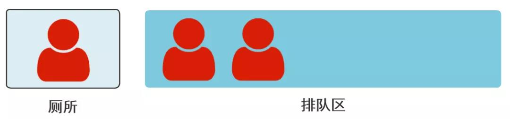
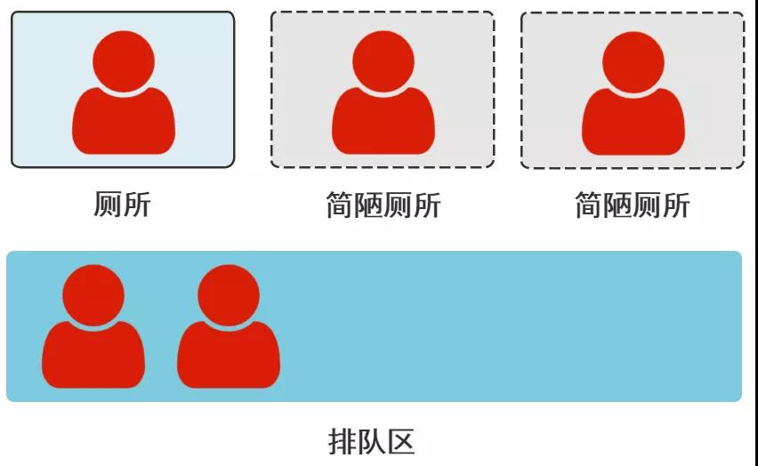

## 线程池为什么设计成这样？
之前我不是写过一篇 Java 线程池原理的文章么，在这里，《你管这破玩意叫线程池》

最终得出了线程池执行流程图。

前几天读者群里有位读者，问了这样的问题。

**这个为啥不是先使用最大线程数，如果没有可用的线程数再放入队列呢？**

我是这样回答的。

**因为设计这个队列的目的是为了暂时解决超出核心线程数的那些线程的问题。当然你说的那样设计也不是不可以，那线程池的用法以及参数的配置经验值，就是新的一套说法了。**

回答完问题后，我就继续工作了，和前端妹子联调一个今天就要提测的接口。

但后来我越想越觉得刚刚的回答不给力，灵机一动，突然想到了好玩的例子，来解释为什么线程池这样设计。

而且，还联想到了很多设计思想，可能就是来源于生活常识。

一看读者群，99+条消息过去了，已经开始聊起了游戏。

想了想就不回复提问的读者了，但实在忍不住想说，就写成文章给大家看吧。

我赶紧和前端妹子说，你先自己调着，我先去带薪上个厕所，马上回。

我就在厕所构思出了这篇文章。

## 2

Java 线程池的设计是这样的：

1. 刚来的任务会通过创建工作线程为其服务，直到工作线程数达到核心线程数。
2. 核心线程数满了后，再来的任务，会加入到一个任务队列中。
3. 任务队列满了之后，再来的任务，就又创建新的工作线程，直到达到最大线程数。
4. 如果再来任务，就走拒绝策略。

当然就是如图所示，再来一遍，别往上翻了。

为啥这么设计呢？我说个场景。

有一条马路，路边住着五个人。

你的任务是在马路旁边建公共厕所，给他们用。

你经过了一番调研，发现同一时间几乎只有一个人，有上厕所的需求。

所以你决定，只建一个公共厕所。

如你所愿，同一时间总是只有一个人上厕所，所以这条马路很和谐。

这一个厕所，就是 **核心线程数 = 1**。

但后来，有一天，有三个人同时要上厕所，外面俩人打起来了。

你一看这不行，于是弄了个排队等待区，让临时上不了厕所的人，在那里等着。

这就是 **任务队列**。

当然，如果你此时选择，立刻再修建两个厕所，供这俩人上，这就是文章开头读者所提的问题。

**这个为啥不是先使用最大线程数，如果没有可用的线程数再放入队列呢？**

当然这样也行，但一方面成本有点大。

另一方面，这可能仅仅是个巧合，这仨人不知道咋了，突然上厕所就想到一块去了。（QPS突增）或者那个厕所里的人，今天坏肚子了，一直没上完。（任务执行得慢）

但是，这种情况很少，不会长期存在的。

果然，如你所料，第二天往后，就再也没有抢厕所的情况存在了。

但慢慢的，这条马路的人也来越多，大家怨声载道，有一次，连排队区都不够长了！

这时你知道，这已经不是突发情况，而是这条马路的人本身变多了，一个厕所确实不够用。

此时你决定，新建几个厕所，以满足新形势。

但这新建的厕所，只是临时的，特别方便拆除。

这些简陋厕所，加上原来的厕所，一共三个，就是 **最大线程数 = 3**。

此时，又缓解了当前这条马路的人口数的如厕需求。

当然，如果之前只是因为这里要开奥运会，导致这条马路上的人短时间很多，所以才临时建立了简陋厕所。

后来奥运会结束，马路上的人又都走了，这些简陋的厕所长时间没人用，就会被拆除。

这就是 **keepAliveTime** 的作用。

但是，如果这条马路就是人口激增，而且是常驻人口，那就会一直保持三个厕所，也就是保持最大线程数。

那假如在这种情况下，也出现了排队区满的情况，那就安排这些人去别的地方上厕所，当然，也可以直接不管他。

这些就属于 **拒绝策略**。

如果一直有大量的人，因为排不上队上不了厕所，被拒绝，那就说明你的规划是有问题的，你没有好好调研清楚。

这时，你应该重新配置你的线程池参数了。

## 3

故事讲完了，其实我发现挺多技术上的设计思路，用生活常识去理解，就很容易解释了。

而很多技术的思想，也都源于生活。

当然这跟那个什么用烧水壶例子，讲 IO 模型可不一样啊，那个是强行用生活的例子解释技术原理，今天这个是用生活里的思想类比技术设计的思想。

大家还有没有类似的源于生活的技术设计思路，可以分享下哦~

[src url](https://mp.weixin.qq.com/s/9-wv_tEsLdphrJX2TsTFwg)